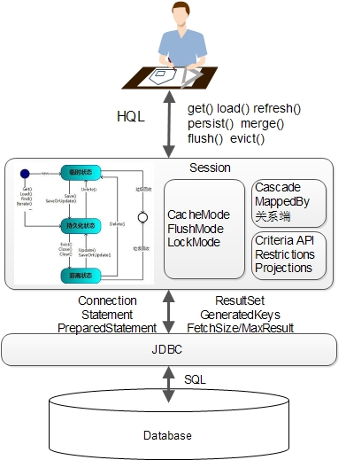
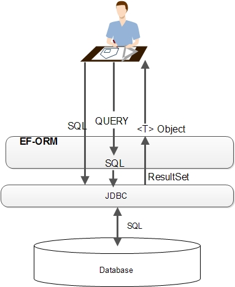
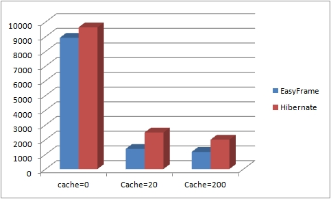

GeeQuery使用手册——Chapter-1  EF-ORM概览

[TOC]

# Chapter-1   EF-ORM概览

## 1.1.  名词解释  

本文中出现的一些术语的解释。其中，知识领域一列指出了对该词条进行定义的知识领域。凡是知识领域为EF-ORM的词条，都是在本文中有特殊定义的词汇。

| 中文名       | 英文名           | 知识领域           | 解释                                       |
| --------- | ------------- | -------------- | ---------------------------------------- |
| 关系数据库管理系统 | RDBMS         | 数据库常识          | 即各种数据库软件本身，如Oracle, DB2,Postgresql等。     |
| --        | DML           | 数据库常识          | Data  manipulation language：指SELECT、UPDATE、INSERT、DELETE四种操作数据的语句。 数据库的事务控制只针对DML。 |
| --        | DDL           | 数据库常识          | Data  definition language：DDL。命令有CREATE、ALTER、DROP等，DDL主要是用在定义或改变表（TABLE）的结构，数据类型等初始化工作上。除了四句DML外其他所有语句一般都认为是DDL，如TRUNCATE也是。 |
| --        | JPA           | Java常识         | Java  EE规范之一，由JCP组织定义的Java持久层(适用于关系数据库)操作规范。JPA有1.0和2.0两个版本，2.0是1.0的补充。 |
| --        | JTA           | Java常识         | Java事务API，由JCP组织定义的Java EE标准之一。使用JTA可以实现分布式事务的一致性。 |
| 注解        | Annotation    | Java常识         | JavaSE特性之一，编程时在代码上增加“@xxx”这样的标注来描述代码的行为。 |
| 简单对象      | POJO          | Java常识         | 只有字段和get/set方法，不继承任何类或接口的java bean。      |
| 实体        | Entity        | Jave  EE   JPA | 一个实体就是用@Entity注解标注的一个类。这个类是一张数据库表的java映射。 |
| 元模型       | Meta-model    | Jave  EE   JPA | 元数据模型，描述数据库表以及其对应的Java类的结构、映射关系等信息的对象模型。在Java中有对应的对象和类。 |
| 增强        | Enhancement   | Jave  EE   JPA | 使用字节码技术对java类文件进行代码植入，从而实现Enity类一些高级行为的技术手段。 |
| 查询        | Query         | EF-ORM         | 一项对数据库操作请求。请不要从字面含义理解为是select语句，查询也可以是一项数据update操作。在EF-ORM中Criteria 和本地化查询都是查询的主要形式，最终都对应某项数据库操作。 |
| --        | Criteria  API | EF-ORM         | 原指JPA 2.0规范制定的一套用对象来实现复杂数据库查询的API。本文中指EF-ORM自身实现的类似功能的API。使用该API可以构造出查询对象（Criteria Query）来执行数据库查询。 |
| 本地化查询     | --            | EF-ORM         | 使用SQL（或JPQL）进行的数据库操作。本地化查询包含NamedQuery、NativeQuery、NativeCall三种。 |
| --        | NativeQuery   | EF-ORM         | 基于增强型SQL或JPQL语句的查询。                      |
| 命名查询      | NamedQuery    | EF-ORM         | 将NativeQuery的SQL语句和变参等信息预先配置并取名，在使用时按名称来调用查询。 |
| 存储过程调用    | NativeCall    | EF-ORM         | 一个调用存储过程的查询。                             |
| 数据库方言     | Dialect       | EF-ORM         | 由于不同RDBMS语法和功能的差异，EF-ORM将这些行为差异集中到一个接口上，并为每个RDBMS单独提供一个实现类，用这种方法来支持不同的RDBMS。每个实现类就是一种方言。 |
|           | Session       | EF-ORM         | 和某H框架相似，主要的数据库操作方法都集中在这个对象上。Session表示一个在事务状态下,或者非事务状态下的数据库操作句柄。  本文中 最常见的DbClient对象，是Session的子类。Session的另一个子类是Transaction类。 |

## 1.2.  主要特点和特性

EF-ORM是一个轻量，便捷的Java ORM框架。在经历了金融和电信等项目的锤炼后，具备了众多的企业级特性。

**主要特点** 

| 特点                  | 描述                                       |
| ------------------- | ---------------------------------------- |
| 轻量                  | 该框架对应用环境、连接池、 是否为J2EE应用等没有特殊要求。可以和EJB集成，也可与Spring集成，也可以单独使用。整个框架模块和功能都较为轻量。 |
| 依赖少                 | 整个框架只有两个jar包。间接依赖仅有commons-lang, slf4j等7个通用库，作为一个ORM框架，对第三方依赖极小。 |
| 简单直接的API            | 框架的API设计直接面向数据库操作，不绕弯子，开发者只需要数据库基本知识，不必学习大量新的操作概念即可使用API完成各种DDL/DML操作。 |
| 最大限度利用编译器减少编码错误的可能性 | API设计和元数据模型（meta-model）的使用，使得常规的数据库查询都可以直接通过Criteria API来完成，无需使用任何JPQL/HQL/SQL。可以让避免用户犯一些语法、拼写等错误。 |
| JPA2规范兼容            | 使用JPA 2.0规范的标准注解方式来定义和操作对象。（但整个ORM不是完整的JPA兼容实现） |
| 更高的性能               | 依赖于ASM等静态字节码技术而不是CGlib，使得改善了代理性能；依赖于动态反射框架，内部数据处理上的开销几乎可以忽略。操作性能接近JDBC水平。对比某H开头的框架，在写入操作上大约领先30%，在大量数据读取上领先50%以上。 |
| 更多的性能调优手段           | debug模式下提供了大量性能日志，帮您分析性能瓶颈所在。同时每个查询都可以针对batch、fetchSize、maxResult、缓存、级联操作类型等进行调整和开关，可以将性能调到最优。 |
| 可在主流数据库之间任意切换       | 支持Oracle、MySQL、Postgres、GBase、SQLite、HSQL、Derby等数据库。  除了API方式下的操作能兼容各个数据库之外，就连SQL的本地化查询也能使之兼容。 |
| JMX动态调节             | 可以用JMX查看框架运行统计。框架的debug开关和其他参数都可以使用JMX动态调整。 |
| 企业级特性支持             | SQL分析，性能统计，分库分表，Oracle RAC支持，读写分离支持，动态字段支持 |

一谈ORM很多朋友都会自然性的和某H框架进行比较，从而发现这些ORM很多都只是功能简单的“玩具”。但是EF不是仅仅是一个玩具。某H框架支持的功能EF-ORM几乎都能支持，或者有替代的支持手段。

**和某H框架支持特性对比**

|                       | 某H框架                                     | EF-ORM                                   |
| --------------------- | ---------------------------------------- | ---------------------------------------- |
| 兼容主流数据库               | 几乎所有数据库。一些过于简单的数据库不支持，如SQLite。           | 支持所有主流数据库，包括SQLite                       |
| 数据库移植性                | 通过配置数据库方言和调整一些映射配置，可以实现移植。  HQL 中的部分语法和函数支持跨库操作。SQL不支持跨库 | 自动检测数据库，自动兼容本地数据库方言，无需人工干预。  SQL/JPQL都支持自动跨库改写。  后续还将支持单Session同时支持多个异构数据库并发操作。 |
| 级联                    | 支持JPA等规范要求的One-toOne, One-to-many, many-to-on,  many-to-many下的CRUD级联操作。 | 除了支持JPA等规范要求四种级联关系外，还保留单表操作的方式，可以使用API在级联操作和单表操作中灵活变化。 |
| 延迟加载                  | 支持级联场景下的各种延迟加载。                          | 除了支持级联场景下的延迟加载外，还支持LOB字段延迟加载。            |
| 投影操作                  | 支持                                       | 支持                                       |
| Criteria  API         | 支持JPA的Criteria API和框架自己的Criteria API     | 支持框架自己的Criteria API。                     |
| 自生成主键策略               | 支持Sequence,Native，Identity，GUID,Hilo,table, Froigen等。一旦配置为非Native方式，会降低可移植性 | 支持Identity、Sequence、Table、Auto(Native)、GUID等策略，Hilo作为辅助算法可以和Sequence或Table随意组合。  Sequence名称可定制，支持自动创建Sequence，支持Sequence步长检测。可根据DBMS自动切换自增方案。 |
| 通过Transformer定义查询结果转换 | 支持Map，支持用Object[]返回多个对象，支持用ResultTransformer类自定义转换逻辑。 | 支持Map，支持用Object[]返回多个对象，支持用Transformer自定义转换逻辑。 |
| 一级缓存                  | 支持。作为Session的核心概念和实现手段，无法关闭。当影响结果正确性时，需通过flush 等API来手动操作。  HQL或SQL等操作不会被缓存，也不会刷新一级缓存中的的数据。 | 支持。可关闭。SQL语句和API操作都会刷新缓存中的数据。            |
| 动态表支持                 | 在进行一些配置和定制后可以支持动态表的单表操作。                 | 原生支持，所有动态表和静态表都会被提取为元模型，后台处理完全一致。因静态表支持的功能均能在动态表上使用，甚至包括动态表和静态表之间的级联操作。  还支持直接扫描数据库结构动态生成元模型。 |
| Oracle  ROWID支持       | 支持                                       | 目前支持得还不太好，待改进。                           |
| JTA事务                 | 支持                                       | 支持                                       |
| Spring集成              | Spring原生支持。方便。支持Spring全部的7种事务传播行为、隔离级别。  | 按JPA规范和Spring集成。方便。提供JPADialect来支持7种传播行为、事务隔离级别、事务超时（标准JPA不支持） |
| 约束，所有表必须有主键           | ORM的基本约束之一                               | 无需此约束                                    |
| 支持数据库逆向工程             | 通过第三方插件可从数据库生成对象映射                       | EF  Eclipse插件可从数据库生成对象映射。还可以从PDM文件中生成对象映射。 |
| 自增值也可以手工指定            | 不支持                                      | 支持                                       |
| 存储过程                  | 不支持                                      | 支持存储过程，支持存储过程返回值的转换和封装  含匿名存储过程，即动态执行一段存储过程。 |
| 命名查询                  | 配置在注解上                                   | 集中配置。可配在XML文件中和数据库中                      |
| 动态SQL                 | 不支持                                      | 可根据条件自动省略SQL语句中的条件、函数等SQL片段。  SQL中可指定部分片段为变量，(如表名、条件等)，在运行时动态形成SQL。 |
| DDL                   | 支持hbm2ddl的配置方式刷新数据库结构。                   | 使用实体扫描器可以验证和刷新数据库结构。同时所有的DDL操作也以API的形式直接提供，用户可随意操作。 |
| 分库分表                  | 不支持                                      | 支持                                       |
| 针对Oracle RAC的优化       | 不支持                                      | 可根据分库路由结果或读写分离策略，单独操作RAC的节点。针对RAC的读写争用问题进行优化。 |
| Oracle  Hint支持        | 不支持                                      | 原生支持Oracle的 /*+ APPEND */等性能优化的手段。       |
| SQL分页改写               | 不支持                                      | 通过内置分析器，直接改写原SQL查询形成count语句。原生支持分页操作。    |
| 绑定变量                  | HQL中支持。API操作均使用绑定变量。                     | SQL/JPQL中支持。API操作均使用绑定变量。(部分方言中禁止绑定变量的情况除外) |
| 数据库关键字判断              | 部分数据库支持                                  | 建立了完整的常用数据库关键字列表，对用到的关键字自动添加引号或`符号，确保带有数据库关键字的操作也都能正常执行。 |

上面是EF-ORM和H框架的一个简单对比。总结下来，EF-ORM的支持功能基本覆盖了大家耳熟目详的H框架，甚至在很多项上要更进一步。但EF-ORM和传统的如H框架,T框架，OpenJPA框架的设计思想是不同的，这些思想上的差异体现在——

* 更多考虑逆向工程数据库的各种场景。
* 要求操作者面向数据库来思维，面向对象的操作手段更多只是带来开发效率的提升和开发难度的   降低。
* 追求更高的性能。
* 同时保留多表级联的关系型操作和单表的操作。能保留在关系型数据库的ER模型的基础上完整的操作数据库，而不是要求用户必须使用对象模型来操作数据库。
* 兼容和保留以SQL为主的传统数据库操作方式，并使之能兼容多种不同的DBMS。在金融和电信领域，还有大量传统的以SQL（甚至是存储过程）为主的数据库使用方式。我们不可能让这些领域的应用完全改弦易帜到纯粹的对象型数据操作上。
* 不但封装了DML操作，也封装了建表、建索引、ALTERTABLE、TRUNCATE等DDL操作。 

除此之外EF-ORM还有很多同类框架中很少具备的企业级应用特性

* 分库分表 
* 分布式事务 JTA 
* 多数据源与路由 
* 多数据源支持
* Oracle RAC FCF支持，Oracle RAC读写分离

综上所述，EF-ORM可以是一个小玩具，但也是支撑大型项目中的企业级框架。

## 1.3.  选择EF的理由

### 1.3.1.  API方式和xxQL(查询语言)之间的平衡

EF-ORM是以轻量、易用为目的设计的开源关系型数据库ORM框架。其特点之一是：

* 尽可能通过编译器检查数据库操作的正确性

  EF-ORM通过原生的元模型和内建的Criteria API来完成类型**安全**的动态查询。 这种查询优于传统的基于字符   串的 Java Persistence Query Language(JPQL/HQL) 查询。本文假设您具备基础的 Java 语言编程知识，并了解常见的 JPA 使用，比如 EntityManagerFactory 或 EntityManager。首先我们来看JPQL / HQL 查询有什么缺陷？

  ​ 

某H框架引入了HQL；JPA 1.0也引进了 JPQL，它们都是强大的查询语言，它在很大程度上导致了各自框架的流行。不过，基于字符串并使用有限语法的JPQL 存在一些限制。要理解 JPQL 的主要限制之一，请查看清单 1 中的简单代码片段，它通过执行 JPQL 查询选择年龄大于 20 岁的 Person 列表：

清单 1. 一个简单（并且错误）的 JPQL 查询

~~~java
EntityManager em = ...; 
String jpql = "select p from Person where p.age > 20"; 
Query query = em.createQuery(jpql); 
List result = query.getResultList(); 
~~~

但是这个简单的例子有一个验证的错误。该代码能够顺利通过编译，但将在运行时失败，因为该 JPQL 查询字符串的语法有误。清单 1 的第 2 行的正确语法为：

~~~java
String jpql = "select p from Person p where p.age > 20"; 
~~~

不幸的是，Java 编译器不能发现此类错误。在运行时，该错误才会出现并提示。

​ 这个例子几乎描述出了一切xxQL（包括SQL）带来的困境。因为我们总是无法轻易发现查询语句中的错误。无论是在语句初次编写后，还是在数据库结构变化后的维护过程中。

而使用Criteria API来执行动态查询，将会安全得多，几乎任何错误都将会被编译器发现并无情的指出，码农可以放心的重构他们的代码乃至数据库，因为编译器会将一切笔误和疏忽指出。不要小看这样一个小小的进步，因为当您考量一个软件的成本会发现，绝大部分的软件成本都是在后期的维护和测试当中。

* 内建的元模型

  JPA引入了meta-model这个概念。OpenJPA可以使用编译的处理器生成名为元模型的类。简单说来，元模型就是将数据表结构用Java类、字段、枚举等形式表现出来的静态结构。我们在代码使用元模型的常量来表示表和列，也就相当于将我们的查询让编译器来校验一遍。

  OpenJPA的元模型是依赖于编译时生成的一个奇特的类，比如Entity类A.java，那么生成一个名为A_.java的原模型类。EF-ORM的元模型则是利用了java的内部类机制。它需要在您的Entity中生成一个 枚举类型。

  ~~~java
  public enum Field implements jef.database.Field {
    field1, field2, …..
  }
  ~~~

  这个枚举就成为了该Entity的元模型描述。可以在构建查询的时候使用。

* Say ‘No’ to XML

  EF-ORM希望尽可能少的配置，以及由此带来的开发效率的提升。因此EF-ORM使用标准JPA注解方式来描述一个Entity。整个过程实现了零配置（如果您不把注解当做配置的话）。

### 1.3.2.  比某H框架更灵活

围绕H框架一直以来都有用性能和效率和灵活性的争论。人们在徘徊于这些问题的同时，往往忽视了H框架这些年来的巨大改进和性能优化。H框架其实提供了让人眼花缭乱的特性，以及优秀的性能。大多数围绕H框架的性能诟病，其实多是使用不当造成的。个人感觉，很多人在H框架的使用中存在以下的问题：

​	1.  对于一级缓存等特性认识并不深刻，甚至有人为了避免麻烦，动辄flush，evict，性能不佳。

​	2.  对于HQL过度依赖，最终走回到拼凑HQL语句的路子上去，就像当初拼凑SQL一样。这十多年前那些拼凑SQL的代码有什么不同？ 除了开发者需要学习一种形似SQL的新查询语言以外，代码的可维护性和开发效率的提升又在哪里？

​	EF-ORM的出发点之一是更简单和直白的使用数据库。并不希望使用者认为自己是在操作一个“对象库”。而是将JDBC用更简练，更方便的手段来封装给用户使用。 

  

EF-ORM干的事情很简单，将SQL语句，或者和SQL语句直观对应的Query对象传给数据库执行操作；同时将查询结果的JDBC封装对象转换成用户需要的各种Object，至于不顾关系型数据库的特色把它封装成一个按主键操作的对象库更是想都没想过。EF-ORM提供的大部分API都可以直观的映射到传统JDBC的操作方式上，并没有虚拟出一个“Session”的对象库。也不存在什么“游离对象”“临时对象””持久对象”之类的概念；无需人工flush、evict。将数据库的一切特性和用法明明白白的展现在开发者面前。对于熟悉SQL的开发者和DBA来说，既保留了某H框架操作的高效，又没有“隔靴搔痒”的困惑。

正是这个特点，使得EF-ORM对于熟悉SQL语句的开发者来说，学习成本非常低。

EF-ORM原汁原味的保留了JDBC的高效特性，这会不会造成开发效率上的降低呢？众所周知，JDBC的开发效率和维护效率要低于各种ORM框架。事实上EF-ORM也汲取了JPA等持久化框架的优点，“拟态”出了某H框架能支持的几乎全部行为，提供了高效而实用的API。在表面上，EF-ORM像是一个完全的面向对象进行操作的ORM框架，实际上这些都是假象。EF-ORM本质上不支持任何对象操作，操作数据库只有两种方式——Query API、SQL。前者可以利用编译器发现大多数操作错误，减少开发者犯错误的可能。后者可以灵活的操作数据库，但保留了对象映射和多数据库兼容等特色。

### 1.3.3.  比○Batis框架更高效

很多朋友在发现某H框架难以适应自己的项目后，最终都选择了○Batis框架作为项目的首选。○Batis也是一个非常优秀的框架。

​	使用动态SQL语句是这个框架的大亮点，这给了开人人员灵活而强有力的武器来操作数据库。但是这也使在这个框架上开发的应用存在数据库移植性上的问题。此外，对象和表的映射关系维护过于繁琐等问题，也困扰着○Batis的使用者。○Batis使用者还需要记忆特定的一系列XML标签来帮助他们实现动态SQL的特性。而且这些也需要纯手工完成。

​	综上所述○Batis的开发效率，和H框架还是有明显的差距的，相对于某H框架这个全自动框架，大多数人认为○Batis更像是一个“半自动”的框架。

​	但是我认为最大的问题不在于开发效率，而在维护效率上。其过于原生的数据库操作方式，难以避免项目维护过程中的巨大成本。当数据库字段变化带来的修改工作虽然可以集中到少数几个XML文件中，但是依然会分散在文件的各处，并且你无法依靠Java编译器帮助你发现这些修改是否有错漏。在一个复杂的使用○Batis的项目中，变更数据库结构往往带来大量的CodeReview和测试工作，否则难以保证项目的稳定性。

​	EF-ORM也有动态SQL的特性，但在一般性的项目中，使用CriteriaAPI和SQL的比例大约是8:2。能够不写SQL就能解决的问题，为什么还要写SQL语句呢。

### 1.3.4.  性能

得益于EF内部的动态反射框架和字节码技术，EF-ORM拥有优秀的性能，几乎接近于直接操作JDBC API。

 在操作大量数据读写的的场合下，这一优势发挥得更为明显。

 用EF-ORM和某H框架进行的读写性能测试表明

 

EF的性能优势来源于

​	1.  使用ASM而不是反射来构造对象。

​	2.  类的增强在编译期就已经完成。

​	3.  大量后期的优化和策略模式的应用。

