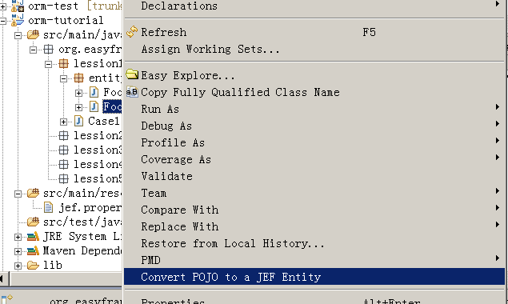
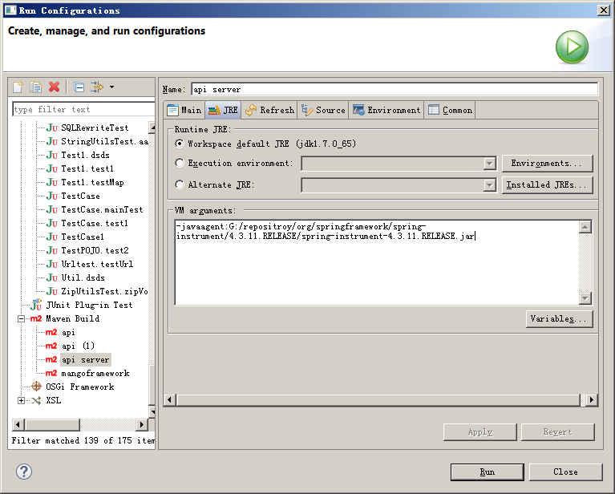
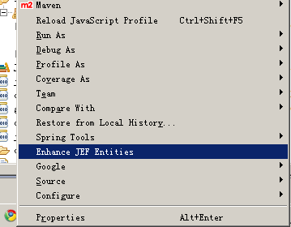
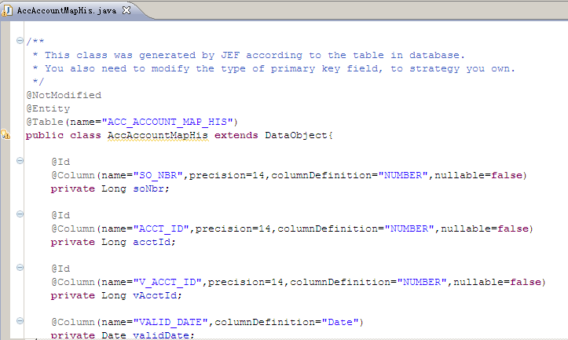

GeeQuery使用手册——Chapter-2  入门 Getting started

[TOC]


# Chapter-2   入门 Getting started

我们在这一章，将帮助您搭建一个简单的测试工程，完成您EF-ORM使用的第一步。

## 2.1.  第一个案例

### 2.1.1.  Install plug-in for Eclipse (非必须)

请先安装EF-ORM foreclipse插件。

1. 在Eclipse的Update Site中增加站点[http://geequery.github.io/plugins/1.3.x/](http://geequery.github.io/plugins/1.3.x/)，
2. 选择help \ Install new Software来安装JEF插件。

### 2.1.2.  运行示例工程

**下载并构建框架**

```
git clone https://github.com/geequery/ef-orm.git
cd ef-orm
mvn install –Dmaven.test.skip=true
```

**打开示例工程**

位于刚才的ef-orm目录下。远程路径是——

<https://github.com/GeeQuery/ef-orm/tree/master/orm-tutorial>

该示例工程中，包含了本文中的所有代码清单。

> 刚引入IDE (如Eclipse) 后，orm-tutorial项目上可能会有一个错误，该错误是由于引用了自制的maven插件，按上面的构建步骤运行 mvn install后，该错误即可消失。

### 2.1.3.  Hello World！

代码示例

src/main/java/org/easyframe/tutorial/lesson1/entity/Foo.java

~~~java
package org.easyframe.tutorial.lesson1.entity;

import java.util.Date;
import javax.persistence.Id;

public class Foo {
	@Id
	private int id;
	private String name;
	private Date created;

	public int getId() {
		return id;
	}
	public void setId(int id) {
		this.id = id;
	}
	public String getName() {
		return name;
	}
	public void setName(String name) {
		this.name = name;
	}
	public Date getCreated() {
		return created;
	}
	public void setCreated(Date created) {
		this.created = created;
	}
}
~~~

src/main/resources/jef.properties

~~~properties
db.type=derby
db.filepath=./
db.name=db
#调试开启，所有SQL和参数都会打印到控制台上
db.debug=true
~~~

src/main/java/org/easyframe/tutorial/lesson1/Case1.java

~~~java
package org.easyframe.tutorial.lesson1;

import java.sql.SQLException;
import java.util.Date;
import java.util.List;
import jef.database.DbClient;
import jef.database.jpa.JefEntityManagerFactory;
import jef.tools.reflect.BeanUtils;
import org.easyframe.enterprise.spring.CommonDao;
import org.easyframe.enterprise.spring.CommonDaoImpl;
import org.easyframe.tutorial.lesson1.entity.Foo;
import org.junit.Assert;
import org.junit.Test;

public class Case1 {
	@Test
	public void simpleTest() throws SQLException{
		DbClient db=new DbClient();
		JefEntityManagerFactory emf=new JefEntityManagerFactory(db);
		CommonDao dao=new CommonDaoImpl();
		 //模拟Spring自动注入
		BeanUtils.setFieldValue(dao, "entityManagerFactory", emf);
		
		//1.创建表
		dao.getNoTransactionSession().createTable(Foo.class); 
		
		Foo foo=new Foo();
		foo.setId(1);
		foo.setName("Hello,World!");
		foo.setCreated(new Date());
		dao.insert(foo);  //2.插入一条记录
		
		//3.从数据库查询这条记录
		Foo loaded=dao.loadByKey(Foo.class, "id", foo.getId());
		System.out.println(loaded.getName());
		
		//4. 更新这条记录
		loaded.setName("EF-ORM is very simple.");
		dao.update(loaded);
				
		//5.删除这条记录
		dao.removeByKey(Foo.class, "id", foo.getId());
		//6.查所有记录，查不到
		List<Foo> allrecords=dao.find(new Foo());
		Assert.assertTrue(allrecords.isEmpty());
		
		//7. 删除表
		dao.getNoTransactionSession().dropTable(Foo.class);
	}
}
~~~

上面这个案例，运行以后，注意观察控制台，将会打印出所有执行的SQL语句和耗时。您将会注意到，EF-ORM在这个案例中，顺序进行了——

建表、插入记录、查出记录、按主键更新记录、按主键删除记录、查所有记录、删除表等7次数据库操作。这就是EF-ORM的“Hello,World”。希望您一切顺利。

### 2.1.4 Spring-boot最简启动

创建以下三个文件

pom.xml

```xml
<project xmlns="http://maven.apache.org/POM/4.0.0"
	xmlns:xsi="http://www.w3.org/2001/XMLSchema-instance"
	xsi:schemaLocation="http://maven.apache.org/POM/4.0.0 http://maven.apache.org/xsd/maven-4.0.0.xsd">
	<modelVersion>4.0.0</modelVersion>
	<groupId>com.basic</groupId>
	<artifactId>database-demo</artifactId>
	<version>0.0.1-SNAPSHOT</version>
	<packaging>war</packaging>
	<properties>
		<spring-boot.version>2.0.4.RELEASE</spring-boot.version>
		<geequery.version>1.12.3.RELEASE</geequery.version>
		<project.build.sourceEncoding>UTF-8</project.build.sourceEncoding>
		<maven.compiler.source>1.8</maven.compiler.source>
		<maven.compiler.target>1.8</maven.compiler.target>
		<maven.compiler.testSource>1.8</maven.compiler.testSource>
		<maven.compiler.testTarget>1.8</maven.compiler.testTarget>
	</properties>
	<dependencies>
		<dependency>
			<groupId>com.github.geequery</groupId>
			<artifactId>geequery-spring-boot-starter</artifactId>
			<version>${geequery.version}</version>
		</dependency>
		<dependency>
			<groupId>org.springframework.boot</groupId>
			<artifactId>spring-boot-starter-jdbc</artifactId>
			<version>${spring-boot.version}</version>
		</dependency>
		<dependency>
			<groupId>org.springframework.boot</groupId>
			<artifactId>spring-boot-starter-test</artifactId>
			<scope>test</scope>
			<version>${spring-boot.version}</version>
		</dependency>
		<dependency>
			<groupId>mysql</groupId>
			<artifactId>mysql-connector-java</artifactId>
			<version>5.1.47</version>
		</dependency>
		<dependency>
			<groupId>junit</groupId>
			<artifactId>junit</artifactId>
			<version>4.12</version>
			<scope>test</scope>
		</dependency>
        <dependency>
			<groupId>joda-time</groupId>
			<artifactId>joda-time</artifactId>
			<version>2.9.9</version>
		</dependency>
	</dependencies>
	<build>
		<plugins>
			<plugin>
				<groupId>com.github.geequery</groupId>
				<artifactId>geequery-maven-plugin</artifactId>
				<version>1.12.3.RELEASE</version>
				<executions>
					<execution>
						<phase>generate-sources</phase>
						<goals>
							<goal>generate</goal>
						</goals>
					</execution>
				</executions>
				<configuration>
					<jdbcUrl>jdbc:mysql://host:3306/operation_account?useUnicode=true&amp;characterEncoding=UTF-8</jdbcUrl>
					<jdbcUser>user</jdbcUser>
					<jdbcPassword>dbpass</jdbcPassword>
					<packageName>com.github.geequery.demo.entity</packageName>
					<targetFolder>${project.basedir}/src/main/java</targetFolder>
				</configuration>
				<dependencies>
					<dependency>
						<groupId>mysql</groupId>
						<artifactId>mysql-connector-java</artifactId>
						<version>5.1.47</version>
					</dependency>
				</dependencies>
			</plugin>
			<plugin>
				<groupId>org.springframework.boot</groupId>
				<artifactId>spring-boot-maven-plugin</artifactId>
				<version>${spring-boot.version}</version>
				<executions>
					<execution>
						<goals>
							<goal>repackage</goal>
						</goals>
						<configuration>
							<skip>true</skip>
						</configuration>
					</execution>
				</executions>
			</plugin>
		</plugins>
	</build>
</project>

```

src/main/java/com/github/basic/yoa/database/MyApplication.java

```java
package com.github.basic.yoa.database;

import javax.persistence.EntityManagerFactory;
import org.slf4j.Logger;
import org.slf4j.LoggerFactory;
import org.springframework.beans.factory.annotation.Autowired;
import org.springframework.boot.CommandLineRunner;
import org.springframework.boot.SpringApplication;
import org.springframework.boot.autoconfigure.SpringBootApplication;
import com.github.geequery.demo.entity.City;
import com.github.geequery.demo.repos.CityRepository;

import jef.database.support.InitDataExporter;

@SpringBootApplication
public class MyApplication implements CommandLineRunner {
	private Logger logger = LoggerFactory.getLogger(this.getClass());
	@Autowired
	private EntityManagerFactory emf;

	public static void main(String[] args) {
		SpringApplication.run(MyApplication.class, args);
	}

	@Override
	public void run(String... args) throws Exception {
        //using emf to access database
	}
}

```

src//main/resources/application.properties

```
#
#    Copyright 2015-2016 the original author or authors.
#
#    Licensed under the Apache License, Version 2.0 (the "License");
#    you may not use this file except in compliance with the License.
#    You may obtain a copy of the License at
#
#       http://www.apache.org/licenses/LICENSE-2.0
#
#    Unless required by applicable law or agreed to in writing, software
#    distributed under the License is distributed on an "AS IS" BASIS,
#    WITHOUT WARRANTIES OR CONDITIONS OF ANY KIND, either express or implied.
#    See the License for the specific language governing permissions and
#    limitations under the License.

#日志配置
logging.level.root=WARN
logging.level.GeeQuery=INFO
logging.level.jef=INFO
logging.pattern.console=%d %t[%-5p] %c{0} - %m%n
#logging.config
#logging.file
#logging.path
#logging.pattern.file
#logging.pattern.level
#logging.register-shutdown-hook
#数据库配置
spring.datasource.url=jdbc:mysql://localhost:3306/test
spring.datasource.username=root
spring.datasource.password=admin
#spring.datasource.schema=classpath:import.sql

#EF-ORM配置 Entity packages
#See com.github.geequery.spring.boot.autoconfigure.GeeQueryProperties
geequery.packagesToScan=com.github.geequery.demo.entity
geequery.repos=com.github.geequery.demo.repos
geequery.useDataInitTable=true
```

然后运行代码生成，将数据库里的表导出成Entity和Spring-data的Repo

```
mvn generate-sources
```


## 2.2.  正式开始EF-ORM之旅  

### 2.2.1.  EF-ORM的原生Entity

在上面的Case1.java中，我们将会发现操作数据库是如此轻松的一件事。如果您有兴趣可以尝试在jef.properties中配置别的数据源，目前EF-ORM能完全支持的RDBMS参见附录二。

在上面例子其实并不是EF-ORM的基本功能，其中使用到了EF-ORM的一个特殊功能，POJO-Support。事实上，EF-ORM中，会希望您用一个更复杂的对象来描述数据库实体而不是上例中的POJO，这样才能使用EF-ORM的全部特性和API。

我们再来一次。将刚才的Foo.java拷贝一份，名叫Foo2.java。除了类名变化外内容无需修改。然后我们在资源树上，文件上点右键，选择“Convert POJO to a JEF Entity ”。

 

您将发现，类的代码变成了下面所示的内容

~~~java
package org.easyframe.tutorial.lesson1.entity;

import java.util.Date;
import javax.persistence.Id;
import javax.persistence.Entity;

@Entity
public class Foo2 extends jef.database.DataObject {
    @Id
    private int id;
    private String name;
    private Date created;
    public int getId() {
        return id;
    }
    public void setId(int id) {
        this.id = id;
    }
    public String getName() {
        return name;
    }
    public void setName(String name) {
        this.name = name;
    }
    public Date getCreated() {
        return created;
    }
    public void setCreated(Date created) {
        this.created = created;
    }
    public enum Field implements jef.database.Field {
        id, name, created
    }
}
~~~

插件会自动在类中插入一些代码，包括JPA实体定义的Annonation，由enum构成的EF-ORM数据元模型(Meta Model)。然后我们可以用更简洁的代码，来重复上面Case1.java的案例。

~~~java
package org.easyframe.tutorial.lesson1;

import java.sql.SQLException;
import java.util.Date;
import java.util.List;
import jef.codegen.EntityEnhancer;
import jef.database.DbClient;
import org.easyframe.tutorial.lesson1.entity.Foo2;
import org.junit.Assert;
import org.junit.Test;

public class Case2 {
	@Test
	public void simpleTest() throws SQLException{
		DbClient db=new DbClient();
		new EntityEnhancer().enhance("org.easyframe.tutorial");
		
		//创建表
		db.createTable(Foo2.class); 
				
		Foo2 foo=new Foo2();
		foo.setId(1);
		foo.setName("Hello,World!");
		foo.setCreated(new Date());
		db.insert(foo);  //插入一条记录
		
		//从数据库查询这条记录
		Foo2 loaded=db.load(foo);
		System.out.println(loaded.getName());
		
		//更新这条记录
		loaded.setName("EF-ORM is very simple.");
		db.update(loaded);
		
		//删除这条记录
		db.delete(loaded);
		List<Foo2> allrecords=db.selectAll(Foo2.class);
		Assert.assertTrue(allrecords.isEmpty());
		
		//删除表
		db.dropTable(Foo2.class);
	}
}
~~~

在Case2.java中，我们可以发现变化——所有的数据库操作都可以直接在DbClient对象上进行了。

细心的同学可能会发现，update语句从原来的

~~~sql
update FOO set CREATED = ?, NAME = ? where ID=?
~~~

 变成了

~~~sql
update FOO2 set NAME = ? where ID=?
~~~

这才是原生的EF-ORM的实现。事实上EF-ORM并不支持直接操作POJO类型的实体。所有EF-ORM中操作的Entity都必须实现jef.database.IQueryableEntity接口。这个接口提供了更多的方法，将各种复杂查询，更新操作等功能集成起来，比如上例中的update语句之所以被优化，就是因为EF-ORM检测到执行过setName方法，而其他字段并未执行过set方法。

上面的例子中，将POJO转换为原生的实体是使用JEF插件进行的，如果您熟练了，也可以自己编码。当然，更多的场合，您的实体是从数据库或PDM文件里导入的，这些场合下都会生成原生的实体。

### 2.2.2.  POJO or Non POJO  

同学们可能会有很多吐槽，我们这里用问答的形式来讲述。

Q: 为什么要实现IQueryableEntity接口或继承DataObject，有什么用处？

A: EF的设计的一个主要目的是提高开发效率，减少编码工作。为此，可以让开发者“零配置”“少编码”的操作数据库大部分功能。而数据库查询条件问题是所有框架都不能回避的一个问题，所以我经常在想——既然我们可以用向DAO传入一个Entity来实现插入操作，为什么就不能用同样的方法来描述一个不以主键为条件的update/select/delete操作？为什么DAO的接口参数老是变来变去？为什么很多应用中，自行设计开发类来描述各种业务查询条件才能传入DAO？为什么我们不能在数据访问层上花费更少的时间和精力?

JPA1.0和早期的H框架，其思想是将关系型数据库抽象为对象池，这极大的限制了本来非常灵活的SQL语句的发挥空间。而本质上，当我们调用某H框架的session.get、session.load、session.delete时，我们是想传递一个以对象形式表达的数据库操作请求。只不过某H框架要求（并且限制）我们将其视作纯粹的“单个”对象而已。JPA 2.0为了弥补JPA1.0的不足，才将这种Query的思想引入为框架中的另一套查询体系------CriteriaAPI。事实上针对单个对象的get/load/persist/save/update/merge/saveOrUpdateAPI和Criteria API本来就为一体，只不过是历史的原因被人为割裂成为两套数据库操作API罢了。

因此，我认为对于关系型数据库而言——Entity和Query是一体两面的事物，所谓Query，可以包含各种复杂的查询条件，甚至可以作为一个完整的SQL操作请求的描述。为此，EF彻底将Entity和Query绑在了一起。这种思想，使得——

1. 开发人员需要编写的类更少。开发人员无需编写其他类来描述复杂的SQL查询条件。也无需编写代码将这些查询条件转换为SQL/HQL/JPQL。DAO层也不会有老要改来改去的接口和API，几乎可以做到零编码。


2. 对单个对象进行CRUD的操作API现在和Criteria API合并在一起。Session对象可以直接提供原本要Criteria API才能提供实现的功能。API大大简化。
3. IQueryableEntity允许你将一个实体直接变化为一个查询（Query），在很多时候可以用来完成复杂条件下的数据查询。比如 ‘in (?,?,?)’， ‘Between 1 and 10’之类的条件。xxQL有着拼装语句可读性差、编译器无法检查、变更维护困难等问题，但是却广受开发人员欢迎。这多少有历史原因，也有Criteria API设计上过于复杂的因素。两者一方是极端灵活但维护困难，一方是严谨强大而学习和编写繁琐，两边都是极端。事实上JPA的几种数据查询方式存在青黄不接的问题。选择查询语言xxQL，项目面临后续维护困难，跨数据库移植性差；选择Criteria API，代码臃肿，操作繁琐，很多人望而却步。EF的设计思想是使人早日摆脱拼装SQL/HQL/JPQL的困扰，而是用（更精简易用的）Criteria API来操作数据库。

不再执着于POJO、还带来了另外一些方面的好处，比如继承DataObject类后可以实现对set方法调用的记录，判断一个字段有没有被赋值，用来优化查询、更新等操作。还有延迟加载特性需要每个entity中记录延迟加载的相关信息。

Q：哎~~我以前用过H框架和My框架都是用POJO映射记录的啊。

A：基于API的功能和易用性之间平衡，EF-ORM最终还是决定让所有的实体实现一个接口，好在这个接口倒无需编写任何代码，直接继承jef.database.DataObject就可以了。从使用者编写的代码来看，倒也能算是”伪POJO”，并不会增加开发的复杂性。

Q:继承DataObject对象后，实体变重了，会不会影响性能？

A:DataObject中的所有字段都是默认为null的，构造方法中不会对其进行初始化，因此对性能几乎没有影响。事实上和H框架的对比测试结果表明了这一点。

Q:Java的单继承结构决定了类只能继承一个父类，这会不会影响开发设计的灵活性？

A:多个Entity依然可以互相继承，只不过是最顶层的Entity需要继承DataObject类。对灵活性的影响多少有一点，但并不明显。

Q:如果我要将Entity使用反射拷贝到别的对象，或者转换为JSON/XML。那么这些父类中的属性不是会干扰我功能的正确性吗?

A:这个问题也考虑过了。父类DataObject中设计的方法，都是和POJO的getter/setter的格式有区别的，反射中一般不会认错。其次这些属性都是标记为transient的，大部分序列化框架（包含JDK内部序列化、Google Gson、FastJSON、JAXB等在序列化时都会忽略这些属性）。

Q：但是前面也演示了直接使用POJO操作数据库，这样用不行吗？

A:在小型项目中可以这样用，但这样做并没有发挥出EF-ORM的特色，事实上这样做性能较差，而且EF-ORM特色Criteria API也无法使用了。POJO的支持更多是为了兼容性的考虑，以及降低一些特定条件下的使用门槛设计的。支持POJO的API都集中在CommonDao上，这是在Spring集成下的一个通用DAO实现。实际上EF-ORM的核心API中都是不支持POJO的。

总之，POJO的问题就这样了，如果您有耐心继续向后阅读，就会明白为什么在这个地方做出如此的取舍，根本原因在于EF-ORM框架和JPA体系框架的设计思想的不同。

### 2.2.3.  实体的增强 

细心的同学还会问，从上面的例子看，Foo2.java中setName()方法的代码中只有一个简单的赋值语句，没有任何监听器之类的设计，EF-ORM怎么可能监测到这个赋值语句被执行呢？

这就必须解释，在OpenJPA和H框架中都有的增强（Enhancement）概念了。实际上在上面的例子中，我们执行了

~~~java
new EntityEnhancer().enhance("org.easyframe.tutorial");
~~~

这个调用实际上对我们编译后的Foo2.class文件进行了代码植入，这种植入称为增强。EF-ORM遵循Java EE 中的JPA规范，允许为实体类进行增强。增强的意思就是说在编译或者运行时修改实体类的一些行为，使得实体能支持更好的ORM特性。

关于实体增强，有兴趣的朋友可以阅读一下OpenJPA中的介绍：[http://openjpa.apache.org/entity-enhancement.html](http://openjpa.apache.org/entity-enhancement.html)

H框架中也有增强，以前H框架总是要依赖一个CGlib，现在则是离不开javassist，就是这个道理。

和H框架在运行时动态执行增强不同，EF-ORM为了更好的性能，直接使用ASM(以前也用过Javassist)直接对磁盘上的静态类做增强。我们分三种情况描述EF-ORM是如何让增强操作不再困扰您的。

#### 2.2.3.1.  Maven构建时静态增强  

可以配置Maven-Plugin，使其在编译完后自动扫描编译路径并执行增强操作。jef-maven-plugin-1.9.0.RELEASE.jar在之前的下载包中可以下载到。

~~~xml
<plugin>
	<groupId>jef</groupId>
	<artifactId>jef-maven-plugin</artifactId>
	<version>${geequery.version}</version>
	<executions>
		<execution>
			<goals>
				<goal>enhance</goal>
			</goals>
		</execution>
	</executions>
</plugin>
~~~

#### 2.2.3.2.  Java Instrument动态增强  

JEF插件可以支持在开发时动态增强实体，其原理和前面的三种方式不同，是动态的。通过使用Java-Instrument技术，在类加载时自动增强类。

操作方式如下：   

在运行的命令行上，增加参数

```
-javaagent:<spring-instrument_jar_location>
```

在运行时增加javaagent参数，并指定spring-instrument-(version).jar的路径。

* spring-instrument版本并无精确要求，可以使用spring 3.x 4.x 5.x的任意一个版本。
* spring-instrument的jar不需要添加到classpath或者pom.xml中去，对Java应用程序没有任何要求。

**在不同的IDE中，命令行参数的配置方式可能是不同的**，但肯定都有，以Eclipse运行为例，见下图。

 


> 这种方式称为运行时增强。（Runtime Enhancement）。
>
> OpenJPA中也有类似概念，方法基本一样，参见—— http://openjpa.apache.org/runtime-enhancement.html

#### 2.2.3.3.  在运行单元测试时

我们经常运行单元测试，很多时候针对单个方法执行单元测试，因此我们可能并无法保证每次运行单元测试的时候都加上-javaagent:<spring-instrument_jar_location>这条命令。

比较直接的办法就是和上面的例子一样，在单元测试的开始(@BeforeClass)，执行一次 

```java
new EntityEnhancer().enhance("org.easyframe.tutorial");   //参数是要增强的类的包名。可传入多个。
```

​    大部分情况下，应用测试会使用Spring框架来构造应用上下文，可以在扫描类文件的时候增强这些类文件。如下例所示，被扫描到的类文件同时即被增强——不过这种方式只能增强那些没有打入jar包的文件。对于已经被打包文件则无能为力，因此主要还是在单元测试场景下使用。

```java
@Bean 
public EntityManagerFactory emf(){
	SessionFactoryBean factoryBean = new SessionFactoryBean();
	factoryBean.setDataSource(new SimpleDataSource(jdbcUrl, jdbcUser, jdbcPassword))
				.setPackagesToScan(new String[] {"com.github.geequery.codegen.entity"})
				.setEnhanceScanPackages(true)
				.setDebug(true);
		return factoryBean.getObject();
}
```

> 本节方法的局限性： 本节介绍的方式，在应用程序运行开始的阶段完成增强操作，但是这种方法有局限性。如果使用IDE的调试工具，一边修改代码一边调试，此时修改后的类会被即时编译后通过虚拟机调试接口重新加载。这些被修改过的类将无法被增强。因此，如果在调试过程中修改了实体类，您最好重新启动应用程序。
>
> 相应的，使用 Java Instrument则没有此问题。


#### 2.2.3.4.  手工增强  

最后，还有一种手动方式，可以修改编译目录下的class文件进行增强。

我们在**工程**上点右键，上下文菜单中就有“Enhance JEF Entites“

 

使用这里的Enhance EF-ORMEntities功能，默认会选中编译输出class文件夹，不用作任何修改直接点确定。

然后可以看到控制台输出：

~~~
enhanced class:org.easyframe.tutorial.lesson1.entity.Foo2
1 classes enhanced.
~~~

这就说明class文件已经被修改。

> *可能有同学会吐槽，说用某H框架这么久，从来也不需要考虑什么增强不增强的问题。*
>
>*我要说，同学你out了。请你看看某H框架最近在干什么——*

 

>*对性能的追求是无止境的，当你接触的项目规模越大，对性能的考虑就越重要。某H框架也不例外。*
>
>*EF-ORM是在2010年参考Open-JPA的做法，将增强设计成静态的。现在看来，静态增强代替动态增强是大势所趋。*

## 2.3.  创建实体

### 2.3.1.  从数据库创建实体

在1.12.3.RELEASE之前，都是使用Eclipse插件从数据库中逆向生成实体的。使用Eclipse插件的方法有以下问题

* 插件中需要集成各个数据库的驱动，插件体积过大。版本兼容性差。
* 由于驱动集成在插件中，因此对于一些冷门的数据库版本没有支持。
* 仅能在Eclipse中使用，对IntelliJ IDEA不友好。


因上述原因，从1.12.3.RELEASE开始，优先使用Maven插件生成实体。

在pom.xml中增加

	<plugins>
	...
			<plugin>
				<groupId>com.github.geequery</groupId>
				<artifactId>geequery-maven-plugin</artifactId>
				<version>1.12.3.RELEASE</version>
				<executions><execution>
						<goals>
							<goal>generate</goal>
						</goals>
				</execution></executions>
				<configuration>
					<jdbcUrl>jdbc:mysql://host:3306/test</jdbcUrl>
					<jdbcUser>my_username</jdbcUser>
					<jdbcPassword>your_password</jdbcPassword>
					<packageName>com.github.geequery.entity</packageName>
					<targetFolder>${project.basedir}/target/generated-sources</targetFolder>
				</configuration>
				<!-- 此处配置你所用的数据库驱动，以MySQL为例-->
				<dependencies>
					<dependency>
						<groupId>mysql</groupId>
						<artifactId>mysql-connector-java</artifactId>
						<version>5.1.42</version>
					</dependency>
				</dependencies>
			</plugin>
当Maven构建时，会自动生成实体类。目前类型映射配置方面还很少，后续会逐渐增加类型映射配置。

如果你需要立即生成实体类。可以使用maven命令——

```
mvn generate-sources
```

### 2.3.2 使用代码生成实体

参见下面示例。

```java
String jdbcUrl = "jdbc:mysql://host:3306/test?useUnicode=true&characterEncoding=UTF-8";
	String jdbcUser = "user1";
	String jdbcPassword = "password2";
	final DbClient db = new DbClient(new SimpleDataSource(jdbcUrl, jdbcUser, jdbcPassword));

	EntityGenerator g = new EntityGenerator();
	g.setProfile(db.getProfile(null));
	g.addExcludePatter(".*_\\d+$"); // 防止出现分表生成类
	g.setMaxTables(999);
	g.setSrcFolder(new File(System.getProperty("user.dir"), "target/generated-sources"));
	g.setBasePackage("com.github.geequery.codegen.entity");
	g.setProvider(new DbClientProvider(db));
	g.generateSchema();
	db.shutdown();
```
### 2.3.3.  从PDM文件导入实体  

参见下面示例

```java
	@Test
	public void testPDMGenerateSource() throws Exception {
		String dbType="postgresql";
		File file=new File("C:\\myfile.pdm");
		
		EntityGenerator g = new EntityGenerator();
		g.setProfile(AbstractDialect.getDialect(dbType));
		g.setProvider(new PDMProvider(file));
		g.setMaxTables(999);
		g.setSrcFolder(new File(System.getProperty("user.dir"), "target/generated-sources"));
		g.setBasePackage("com.github.geequery.codegen.entity");
		g.generateSchema();
	}
```


一个自动生成的实体可能如下所示：正常情况下所有的主键、表名、字段长度定义都已经以Annotation的形式标注出来。这意味着你可以用这个实体直接进行表的操作了。

 

自动生成的实体中，关于自增主键的生成规则‘GeneratedValue’还有各种多表关系一般需要手工调整，手工修改JPA注解等介绍参见后文。

### 2.3.3.  常用JPA Annotation

#### 2.3.3.1.  注解的使用  

除了上述两种导入方式外，您也可以直接编码来创建实体。请看下面这个代码例子中的注释信息

~~~java
package jef.orm.onetable.model;

import java.util.Date;

import javax.persistence.Column;
import javax.persistence.Entity;
import javax.persistence.GeneratedValue;
import javax.persistence.GenerationType;
import javax.persistence.Id;
import javax.persistence.Table;
import jef.database.annotation.Index;
import jef.database.annotation.Indexed;
import jef.database.annotation.Indexes;
import jef.database.DataObject;

@Entity
@Table(schema = "ad", name = "ca_asset")  //这里定义表所在的schema和名称，schema可不写
public class CaAsset extends DataObject {
	/**
	 * Asset ID
	 */
	@Id               //说明这个字段是主键字段
	@GeneratedValue(strategy = GenerationType.IDENTITY) //使用列自增生成值，不支持列自增再Sequence
	//定义该字段在数据库中的列名，number长度。是否可为null。
	@Column(name = "asset_id", precision = 6, columnDefinition = "NUMBER", nullable = false)
	//可以指定Sequence名称，但不建议定义，EF-ORM支持全局配置一个模板，来生成各个表的Sequence名称。
	@SequenceGenerator(sequenceName="ca_asset_seq",name="ca_asset_seq") 
	private int assetId;

	/**
	 * A unique identifier of account.
	 */
	@Id
	//重要,EF-ORM允许一个对象中有多个@Id字段，即复合主键。
	//在某些关系表上，业务键要比物理键实用的多。这个与标准JPA的做法不同。
	//EF-ORM更倾向支持传统的数据库设计，而不是用面向对象来代替数据库设计。
	//因此，如果您正在使用EF-ORM，请在该用业务键的时候大胆的用业务键，
	//不需要也不建议为每个表都生成一个物理主键。让更专业的DBA来设计数据库吧。
	@Column(name = "acct_id", precision = 14, columnDefinition = "NUMBER")
	private Long acctId;

	/**
	 * Asset type: 0- fund(account book), 1- credit limit, 2- bonus, 3- bank
	 * capital, 4- free resource, 5 - cheque.
	 */
	@Column(name = "ASSET_TYPE", precision = 8, columnDefinition = "NUMBER")
	@Indexed    //EF-ORM特有的注解，在建表时可以为这个列创建B树索引。
	private Integer assetType;

	@Column(name = "COMMENTS", length=512, columnDefinition = "varchar")
	private String normal;

	@Column(name = "CONTENT", columnDefinition=”clob”)
	@Lob            //CLOB字段一般映射为String，也可以映射为File, char[]等
	private String content;

	//byte[]构成的Lob会映射为BLOB（在某些数据库上为BYTEA）。BLOB在java中还可以映射为
	//String, File等。
	@Lob    
	private byte[] photo;

	@Column(name = "PRICE", precision =12,scale=8, columnDefinition = "number")
	//对于小数，precision=12 scale=8的意思是整数部分最多4位，小数部分最多8位。(和Oracle定义一致）
	//理解为整数部分最多12位的同学都去面壁！
	private double price;
	
    @#
	@Column(name = "VALID_DATE",columnDefinition="Date")
	//注意，这里定义为Date时，精度为年月日，不含时分秒。定义为Timestamp时，精度到时分秒乃至毫秒。
	//操作Oracle数据库也遵守相同的规律。
	//Oracle同时具有Date和Timestamp两种类型，但和别的数据库不一样，其Date精度到秒。
	//此处我们沿用JDBC标准，Date精度到天。确保实现的可移植性。
	private Date thedate;
	
	public enum Field implements jef.database.Field {
		acctId, assetId, assetType,thedate,normal,content
	}
    //getters and setters
}
~~~

总结一下，

1. 上面提到了常见数据类型的定义方法。

   而常见的数据类型不外乎varchar,blob,clob number, integer, nclob, nvarchar, double, float, bigint,Boolean等。

   值得一提的是，您可以用java当中的Boolean类型。EF-ORM会根据方言的不同，支持原生boolean类型的数据库中，映射为Boolean，不支持原生Boolean的则映射为char(1)。

2. 索引的定义方法

3. 复合主键的定义方法

4. 自增键的定义方法。需要指出的是，如果数据类型为String，而GenerationType=AUTO或IDENTITY时，会使用GUID生成主键，此时要求字段长度36位。

另外，上例中@Table(schema = "ad", name = "ca_asset") 中指定了表所在的Schema为ad，这项配置是可以在运行环境中被重新映射的，相关特性参见7.3.1节Schema重定向。

#### 2.3.3.2.  映射关系和注解的省略

许多时候注解可以省略，省略时，EF-ORM会根据默认的数据类型计算相应的数据库存储类型。事实上，columnDefinition也可以写成int, double, integer,varchar2等各种标准的SQL类型。因此，如果不指定Column类型，EF-ORM会默认的生成Column的类型如下

| **Java类型**                              | **数据库类型**              |
| --------------------------------------- | ---------------------- |
| String + @Lob                           | CLOB                   |
| String                                  | Varchar(255)           |
| Int / Integer                           | Integer /  Number(8)   |
| double/Double                           | Double /  Number(16,6) |
| float/Float                             | Float /  Number(16,6)  |
| boolean /Boolean                        | Boolean / char(1)      |
| Long / Long                             | Bigint /  Number(16)   |
| java.util.Date / Instant /LocalDateTime | timestamp /  datetime  |
| java.sql.Date / LocalDate               | Date                   |
| java.sql.Timestamp                      | timestamp /  datetime  |
| byte[]                                  | BLOB                   |
| Enum                                    | varchar(32)            |
| LocalTime                               | time / timestamp       |
| YearMonth                               | char(7)                |

​					**表 1-1 映射关系**

上表列举了您未定义Column注解时，java字段到数据库的映射关系。这也是建议您在实际使用注解时进行的映射方式。在实体加载时，EF-ORM会适配实体与数据库的映射关系，如果发现属于无法支持的映射（EF-ORM能兼容大部分不同数据类型的映射，包括从String到number等），那么会抛出异常，此时您需要修改java的映射字段类型。

值得注意的是EF-ORM支持您使用enum对象和varchar列发生映射，使用枚举类型有助于提高您应用系统的可理解性。


