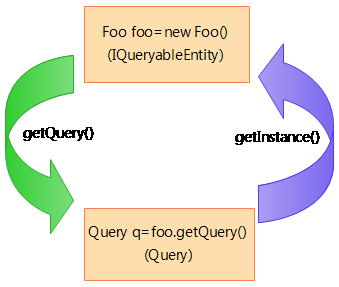
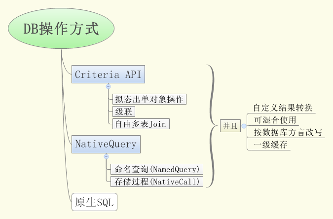

GeeQuery使用手册——Chapter-3  基本操作与对象映射

[TOC]

# Chapter-3  基本操作与对象映射

## 3.1.  基本单表操作

本节介绍几种常用的单表查询方式，EF-ORM还支持更多复杂的查询，后面几节中还会继续描述。

在Hello,World!案例中，我们已经了解了实现单表基于主键进行增删改查操作的方法。我们来回顾一下，在此处和后面的代码清单中，我们都在session对象上操作数据库，这里的session对象可以理解为就是DbClient对象。

~~~java
        Foo foo=new Foo();
		foo.setId(1);
		foo.setName("Hello,World!");
		foo.setCreated(new Date());
		//1.插入一条记录
		session.insert(foo);  
		
		//2.从数据库查询这条记录
		Foo loaded=session.load (foo);
		System.out.println(loaded.getName());
		
		//3. 更新这条记录
		loaded.setName("EF-ORM is very simple.");
		session.update(loaded);
				
		//4.删除这条记录
		session.delete(loaded);
~~~

在上面的Foo对象中，其Id属性被标记为主键。当id属性有值时，load方法,update方法、delete方法都是按主键操作的。上面的操作，归纳起来就是插入记录、按主键加载、按主键更新、按主键删除。

### 3.1.1.  复合主键

当有复合主键的场景下，情况是完全一样的：

在所有作为主键的列上增加@Id注解。

代码src/main/java/org/easyframe/tutorial/lesson2/entity/StudentToLesson.java

~~~java
package org.easyframe.tutorial.lesson2.entity;

import java.util.Date;
import javax.persistence.Entity;
import javax.persistence.Id;
@Entity
//描述学生和课程映射关系的表
public class StudentToLesson extends jef.database.DataObject {
    @Id
    private int studentId;  //复合主键一
    @Id
    private int lessonId; //复合主键二
    private Date createTime;
    public enum Field implements jef.database.Field {
        studentId, lessonId, createTime
}
//getter setter省略
}
~~~

**调整复合主键顺序**

在上例中，我们执行

~~~java
db.createTable(StudentToLesson.class);
~~~

建表时的定义是

~~~sql
create table STUDENT_TO_LESSON(
    CREATETIME timestamp,
    STUDENTID int not null,
    LESSONID int not null,
    constraint PK_STUDENTTOLESSON primary key(STUDENTID,LESSONID)
)
~~~

在复合主键中studentId在前，lessonId在后，怎么样其调整为lessonId在前，studentId在后呢？ 

对于1.8.0以下版本，方法是将lessonId的定义移动到studentId之前。

1.8.0以后的版本，是在枚举的enum Field中将lesseionId移动到studentId之前。

> *1.8.0之前，EF-ORM是采用class.getDeclaredFields()方法来获取字段顺序的。而JDK也确实按照定义的顺序返回了这些字段，但是java虚拟机规范上说：“The elements in the array returned are not sorted and are not in anyparticular order.”也就是说，虚拟机规范不保证字段返回的顺序，因此这种调节方式可能无效。*
>
> *1.8.0之后，改为使用enum中出现的顺序来排序字段。*

有同学可能会问，你搞这个功能有什么意义呢？复合主键字段顺序的无论怎么变化其产生的约束效果是一样的。

实际上这不一样。数据库会为复合主键创建一个同名的复合索引。在上例中，我们如果要查询某个学生(studentId)的课程选修情况，那么studentId列在前可以让我们无需再为studentId创建单独的索引。事实上Oracle DBA们往往会称其为“复合索引前导列”。精确控制复合主键的顺序可以改善你的数据库设计中的索引规划，而无故增加索引则会造成每次CRUD时无谓的开销。

**其他**

使用过JPA的同学可能会说，EF-ORM这里的处理不规范啊，JPA规范中碰到复合主键都是必须定义一个@IdClass，要么作为一个独立类要么用@EmbeddedI嵌入对象中，你这种支持方法不是标准JPA的支持方式。

我的回答是：JPA的规范在实际使用时问题很多。由于凭空增加了一个对象的关系，在实际编码时需要增加大量的非null判断、主键对象必须实现hashCode和equals方法、主键值设置时是替换主键对象还是更新主键对象方法不统一，操作起来问题很多。这种坏味道甚至影响了代码的健壮性。实际情况下，大部分JPA使用者和H框架使用者会主动的给表增加一个物理键，避免使用业务键（复合主键），但操作中又基本上使用业务键来增删改查，物理键几乎无用。这样的因素也将影响DBA对数据库的设计发挥。

因此，在EF-ORM中，不支持标准JPA的复合主键方式，而是采用上文所述的方式。就像传统关系型RDBMS表结构定义那样，为平铺的属性增加两个主键的标识即可，类似于在PowerDesigner中定义主键那样。我还是那么想，既然用了关系数据库，就要让关系数据库的优势体现出来。

### 3.1.2.  主键自增

#### 3.1.2.1.  自增值自动回写

正常情况下，执行插入操作后，数据库生成的自增值主键值都会被设回对象中，我们看下面的示例。

src/main/java/org/easyframe/tutorial/lesson2/entity/Student.java

~~~java
package org.easyframe.tutorial.lesson2.entity;

import javax.persistence.GeneratedValue;
import javax.persistence.GenerationType;
import javax.persistence.Id;
import javax.persistence.Entity;

@Entity
public class Student extends jef.database.DataObject {
	/**
	 * 学号
	 */
    @Id
    @GeneratedValue(strategy=GenerationType.AUTO)    //使用GeneratedValue表示自增键值
    private int id;
    /**
     * 姓名
     */
    private String name;
    /**
     * 年级
     */
    private String grade;
    /**
     * 性别 
     */
    private String gender;
    public enum Field implements jef.database.Field {
        id, name, grade, gender
	}
   //getter setter省略
}
~~~

src/main/java/org/easyframe/tutorial/lesson2/Case1.java

~~~java
@Test
public void studentAutoIncreament() throws SQLException{
  	db.createTable(Student.class);
  	Student s=new Student();
  	s.setName("Jhon Smith");
 	s.setGender("M");
  	s.setGrade("2");
  	db.insert(s);

  	Assert.assertTrue(s.getId()>0);
  	System.out.println("自增键值为："+s.getId());
}
~~~

从上例可以发现，当insert方法执行后，自增值即被回写到对象中。每次调用Session中的操作方法，都是即时操作数据库的。再说一次，EF-ORM是JDBC的封装，目的是帮助用户更精确和更简便的操作关系数据库。所以不会有一个“对象池”的概念，将您所有操作记录下来，到最后再执行。
此外，无论在何种数据库下、无论在单条还是batch模式下（Batch模式以后会讲到），插入操作生成的值都会被回写到对象中。
对于自增值的生成有很多用法，后文详细讲述。

#### 3.1.2.2.  四种JPA主键生成方式

EF-ORM支持JPA的主键生成方式。以下是JPA注解的实现方式

~~~java
@Id
@GeneratedValue(strategy = GenerationType.IDENTITY)
private String id;
~~~

JPA注解中的GenerationType有四种，其用法如下

| 注解类型     | 含义                  | 在EF-ORM中的用法                              |
| -------- | ------------------- | ---------------------------------------- |
| AUTO     | 自动，根据当前数据库等自动选择自增实现 | 1.为int或long类型时，根据数据库自动选择 Identity  > Sequence > Table 。(由于数据库多少都支持前两个特性，所以实际上Table默认不会被使用 )  2.如果字段是String类型，使用GUID策略(即32位guid)。 |
| IDENTITY | 使用列自增特性             | 1. 为int或long类型时，使用表的列自增特性  2.如果字段是String类型，使用GUID策略(即32位guid)。 |
| SEQUENCE | 使用Sequence。         | 使用Sequence生成自增值                          |
| TABLE    | 使用Table模拟Sequence。  | 使用Table生成自增值                             |

如果不配置，那么会隐式使用Annotation的默认值AUTO。

下面列举几种规则的用法和效果，嫌麻烦的可以直接跳转到3.1.2.6章看结论。

#### 3.1.2.3.  配置的简化

上述四种配置的基础上，EF-ORM进行了一些配置的简化。形成了一套独有的规则。

**1 . 识别为GUID**

当字段类型为String时，如果自增方式为Identity或Auto那么使用guid策略。 但如果为Sequence和Table，EF-ORM还是认为该字段属于自增值，数据库中会使用Int等数值类型，只不过在java类中自动转换为String。

**2. 识别为AUTO**

当EF-ORM获得一个自增值的注解配置后，默认情况下会将Sequence和Identity两种方式忽略，理解为AUTO方式。因为Identity和Sequence方式都有跨数据库移植性差的问题，为了更好的支持数据库Native的自增实现方式， EF-ORM默认Identity和Sequence方式都等同于Auto。除非用户禁用Native支持功能，即在jef.properties中配置

~~~properties
db.autoincrement.native=false
~~~

**3. 按本地数据库能支持的方式实现自增**

对于AOTU类型，按 数据库列自增 > Sequence > Table这样的优先级，使用数据库能支持的方式实现自增。

对于Sequence类型，按 Sequence > Table这样的优先级，使用数据库能支持的方式实现自增。

对于Table类型，使用Table模拟Sequence方式实现自增。由于默认情况下数据库多少都会支持优先度更高的两种特性之一。所以Table方式会很少用到。

**4. 不使用数据库列自增方式的场合**

以下两种情况下，EF-ORM会认为列自增特性不可使用

* 数据库方言中指定不支持的，如Oracle，这是大家容易想到的。
* 对象开启了分库分表功能的，由于分库分表后列自增值不能保证唯一性，因此会认为不支持。

#### 3.1.2.4.  Sequence或Table下的其他配置

可以用JPA注解@SequenceGenerator或@TableGenerator两者，为自增值设置Sequence名或表名。

例如：

~~~java
	@GeneratedValue(strategy = GenerationType.TABLE)
	@TableGenerator(name = "AA1", initialValue = 1, allocationSize = 10, valueColumnName = "TABLE", pkColumnValue = "SEQ_VALUE", table = "T_SEQ_1")
	private int tableSeq;     //指定生成Sequence的表名为T_SEQ_1

	@GeneratedValue(strategy = GenerationType.SEQUENCE)
	@SequenceGenerator(name = "VVVV", sequenceName = "SEQ_A1", initialValue = 1000)
	private int seq;          //指定SEQUENCE的名称为SEQ_A1
~~~

通过这种方式，您也可以让多张表共享一个Sequence或Table。

 需要注意的是，@SequenceGenerator仅在GenerateType为SEQUENCE时生效，@TableGenerator仅在GenerateType为TABLE时生效。这里的GenerateType不是指你注解里写的是什么，而是按照3.1.2.2的简化规则计算后生效。 也就是说，这两个注解不会影响EF-ORM用什么方式来实现自增，只会在确定自增方式之后，调整自增的实现参数。
默认情况下，您都不需要配置这两项内容，EF-ORM全局配置参数中可以配置命名模板，会根据模板来计算Sequence的名称。如果您单独配置了Sequence的名称，那么会覆盖全局配置。但从项目实践看，我们更建议您使用模板的方式，全局性的命名Sequence。
默认情况下，全局Sequence的名称为“%_SEQ”,其中%是表的名称。也就是说，名为”TABLE1”的表，其使用Sequence为”TABLE_SEQ”。

如果表的名称大于26个字符，会截取前26个字符。如果你有两张表名称达到或超过26个字符，并且前26个字符都是一样的，那么这两张表会公用同一个SEQUENCE。这是为了防止出现SEQUENCE名称大于30个字符，在Oracle下你无法创建大于30个字符的数据库对象。
前面既然说了Sequence名称模板默认为”%_SEQ”，那也意味着您可以修改名称模板，比如您可以把它改为”S\_%” 。修改方法是jef.properties中。

~~~properties
sequence.name.pattern=S_% 
~~~

对于Table模拟Sequence，也可以全局配置， 可以是全局一张表实现所有Table Sequence值。例如创建一张名为GLOBAL_SEQ_TABLE的表，要启用此功能，可以在jef.properties中

~~~properties
db.public.sequence.table=GOOBAL_SEQ_TABLE
~~~

综上所述，一般情况下，我们不需要使用@SequenceGenerator 和 @TableGenerator注解。

#### 3.1.2.5.  Sequence或Table的性能优化

**Hilo算法**

熟悉数据库的人都知道，大量数据并发插入时，频繁到数据库中去获取Seqence性能是很差的。
某H框架支持hilo算法来优化Sequence的取值性能，原理是对获得到的值乘以系数，将值的范围放大后自动填充范围内的值，从而一次访问数据库客户端能得到多个不重复的序列值。
在EF-ORM中，将Hilo算法作为一种修饰器。当使用Table和Sequence两种方式，都可以添加Hilo算法的修饰。
比如:

~~~java
@Id
@GeneratedValue(strategy = GenerationType.SEQUENCE)
@HiloGeneration(maxLo=20)
private int idSeqHilo;
~~~

或者:

~~~java
@Id
@GeneratedValue(strategy = GenerationType.TABLE)
@HiloGeneration(maxLo=20)
private int id;
~~~

其中maxLo的含义和H框架相同。每次都是生成value *(maxLo + 1) 到 value * (maxLo +2)范围内的值，算法此处不解释，请自行百度。
@HiloGeneration仅对SEQUENCE和TABLE两种算法有效，如果按上一节的规则，最终使用数据库列自增方式，那么@HiloGenerator注解会失效。比如我们可以配置下面的自增主键：

~~~java
	@Id
	@GeneratedValue(strategy = GenerationType.AUTO)
	@HiloGeneration(maxLo=20)
	@SequenceGenerator(name = "S1", sequenceName = "S_TABLE1", initialValue = 1000)
	@TableGenerator(name = "S2", valueColumnName = "TABLE", pkColumnValue = "SeqValue", table = "TABLE_SEQ_GOLBAL")
	private int id;
~~~

上面的注解配置，在不同数据库下会产生不同的表现——

在MySQL下，@HiloGeneration、@SequenceGenerator、@TableGenerator都不会生效。（使用自增列，故这些生成规则都无效）

在Oracle下，@HiloGenerator和@SequenceGenerator会生效。（Oracle下默认使用SEQUENCE）

如果这张表启用了分库分表功能，那么在Oracle下情况不变。而在MySQL下，因为MySQL不支持Sequence，最终实际上变为TABLE模式，此时@HiloGenerator和@TableGenerator即会生效。

**步长跳跃**

这是另一种优化方式，步长跳跃的意思就是让Sequence或Table中的值不是每次自增1，而是一次性跳好几个数值，然后由EF-ORM自动填补这中间的空白整数。也可以起到一次访问数据库获得多个序列值。

使用Hilo的情况，如果随意修改Hilo的参数，很有可能造成主键冲突。此外数据库中的序列值和表中的ID之间也很难对应起来。从数据库维护角度来看很不直观，因此EF-ORM更为推荐步长跳跃这种方式来优化序列值的获取。

事实上，在使用TABLE方式时，EF-ORM已经用了这个方法一次性将表中的Value值加上较大的一个值。这个值就是 sequence.batch.size，默认20，也就是说一次访问数据库就获得20个序列值。

而如果使用数据库原生的Sequence，那么如何优化呢？

对于Oracle数据库，你可以直接将Sequence的步长调节为更大的值，例如40.

~~~sql
alter sequence TABLE1_SEQ increment by 40 cache 20;
~~~

EF-ORM会在首次使用Sequence前，检查Sequence的步长，这是自动的。非Oracle下，EF-ORM不会主动检查步长。

如果在非Oracle数据下使用Sequence跳跃，例如Postgres，可以使用jef.properties参数

>*#当设置为-1时，强制检查Sequence步长；0时仅检查Oracle步长；1时步长固定为1；其他>0数			值：步长固定为配置的值*   

~~~properties
db.sequence.step=-1
~~~

当配置为>0的数值时，Sequence步长固定为指定值（不推荐这样做），因为这样配置时如果和数据库中的Sequence实际步长不匹配，可能出现错误。

正常情况下，如果步长为5，selectX_SEQ.nextVal from dual如果返回结果=10，那么实际上EF-ORM会获得10,11,12,13,14这样五个值。再次调用后，数据库端的Sequence值=15，实际使用序列号到19为止。

由于非Oracle数据库没有有效的Sequence步长检测机制，在非oracle上检测步长将消耗掉一个Sequence值。

在Oracle上，如果数据库用户权限被严格限制，可能会无权限访问user_sequences视图，此时您需要将db.sequence.step配置为一个正数来避免自动检查步长。

#### 3.1.2.6.  配置方法和总结

对前面的种种规则比较含糊的同学，直接看这一节就行了。

|                      | **H框架中的用法**                              | **EF-ORM对应**                             | **EF-ORM下特点**                            |
| -------------------- | ---------------------------------------- | ---------------------------------------- | ---------------------------------------- |
| identity             | 数据库列自增特性，不支持Oracle。                      | @GeneratedValue(strategy = GenerationType.IDENTITY) | 在Oracle下自动转换为Sequence                    |
| sequence             | 仅在支持SEQUENCE的数据库上可用，必须指定Name。如果没有指定则默认为全局唯一的’hibernate_sequence’。 | @GeneratedValue(strategy = GenerationType.SEQUENCE) | Oracle等支持Sequence的数据库下Sequence会自动命名、自动创建。  MySQL等不支持的数据库下自动转换为Identity或Table。 |
| hilo(table hilo)     | 使用高/低位算法生成数值型，给定一个表和字段作为高位值的来源，默认的表是hibernate_unique_key，默认的字段是next_hi。它将id的产生源分成两部分，DB+内存，然后按照算法结合在一起产生id值。目的是减少访问次数提高效率 | @HiloGeneration  @GeneratedValue(strategy = GenerationType.TABLE) | 可支持所有数据库。通过序列步长调整也可保持高性能。                |
| native               | 对于 oracle 采用 Sequence 方式，对于MySQL 和 SQL Server 采用identity（自增主键生成机制） | @GeneratedValue(strategy = GenerationType.AUTO) | Sequence可以做到一表一Sequence。 自动命名和创建         |
| seqhilo              | 由于局限于支持Seq的数据库，所以少用。                     | @HiloGeneration  @GeneratedValue(strategy = GenerationType.SEQUENCE) | 默认情况下还可以使用数据库列自增。仅在Oracle下生效。            |
| uuid.hex uuid.string | 从H框架3.0开始已经不再支持uuid.string               | @GeneratedValue(strategy = GenerationType.IDENTITY) | 数据类型为String时自动适配。  效果和H框架一样              |
| assigned             | 人工指定                                     | 不配置                                      | EF-ORM可支持assigned，还支持手动和自增方式混用。          |
| foreign              | 使用外部表的字段作为主键                             | 不支持                                      | --                                       |

结论，对于大部分情况，大家只要对自增主键配置

~~~
@Id
@GeneratedValue(strategy = GenerationType.IDENTITY)
~~~

就行了，别的啥都不用操心了。在常见数据库中，如果是在Oracle下发现获取Sequence不够快，那么可以按照3.1.2.5的方法进行优化。

### 3.1.3.  查询操作

在了解了单表插入和主键自增后，我们来看其他操作。在类jef.databse.Session当中，有着load(T entity)和select(T entity)方法。之前的例子中我们一直用这个方法来查询插入的记录。EF-ORM会按照对象中存在的主键进行查询。这是不是这个方法的唯一用法呢？除了这个方法之外，有没有其他方法按主键查询对象呢？

#### 3.1.3.1.  按主键或模板查询

其实、前面用到的load方法和select方法并不仅仅是按照主键进行数据查询，它们其实是将传入对象当做一个模板来使用的，参见下面一组例子。

~~~java
	@Test
	public void testLoadAndSelect() throws SQLException{
		//创建一个模板对象,当模板对象主键有值时，按模板对象的主键查询。
		{
			Student query=new Student();
			query.setId(3); //id是主键。
			Student st=db.load(query);	//按主键查询返回单条记录
		}
		//直接按主键查询,当对象为复合主键时,可传入多个键值。
		//键值数量必须和复合主键的数量一致，顺序按field在emun Field中的出现顺序。
		{
			Student st=db.load(Student.class, 3);
			StudentToLesson stl=db.load(StudentToLesson.class, 3, 1);
		}
		//load方法都是查询单值的，select方法可以查询多值
		//创建一个模板对象,当模板对象的字段有值时，按这些字段查询
		//类似于某H框架的 findByExample()。
		{
			Student query=new Student();
			query.setGender("F");
			query.setGrade("2");
			List<Student> sts=db.select(query);//查出所有Gender='F' and grade='2'的记录。
		}
		//如果一个对象的复合主键没有全部赋值，那么也当做普通字段对待
		//最终效果和findByExample()一样。
		{
			StudentToLesson query=new StudentToLesson();
			query.setLessonId(1);
			List<StudentToLesson> sts=db.select(query);//查出所有lessonId='1'的记录。
			
		}
		//如果一个对象的主键都赋了值，非主键字段也赋值。那么非主键字段不会作为查询条件
		//因为框架认为主键字段足够定位记录，所以非主键不用作查询条件。
		{
			Student query=new Student();
			query.setGrade("1");
			query.setId(12);
			List<Student> sts=db.select(query); //查询条件为 id=12。grade不用作查询条件
		}
	}
~~~

从上面的例子，我们可以发现

1.     load和select区别在于一个返回单条记录，一个返回多条记录的List。

2.     load和select对于传入的条件，判断其主键是否就绪，有则按主键查询，没有则将传入对象当做一个模板查询。

3.     另外有一个load(Class, Serializable…)的方法，可以直接传入对象类和主键值来加载单条记录。

4.     复合主键必须全部都赋值才认为主键就绪，否则也是将传入对象当做模板查询。

#### 3.1.3.2.  更复杂的条件

按主键或模板查询能适应不少查询场景，但还远远不够。比如我们要查询所有姓名中带有”Jhon”字样的学生。用SQL语句表达的话，就是

~~~sql
where name like ‘%Jhon%’
~~~

对象Student看似无法描述这种带有运算符的条件。但不要忘了我们的Student已经实现了jef.database.IqueryableEntity接口，这使Student对象携带复杂的条件成为可能。

代码清单： src/main/java/org/easyframe/tutorial/lesson2/Case1.java

~~~java
@Test
public void testSelect_Like() throws SQLException{
    Student query=new Student();
    //在Student对象中添加Like条件
    query.getQuery().addCondition(
    	Student.Field.name.matchAny("Jhon");
    List<Student> sts=db.select(query);

    Assert.assertEquals(sts.size(), db.count(query.getQuery()));
}
~~~

在上例中，我们从Student对象中通过getQuery()得到一个Query对象，我们可以在这个Query对象上添加各种复杂条件。我们在后面的章节可以了解到，这里可以放入几乎SQL语句所能写出的所有查询条件和修饰，例如Order By等等。Query对象的出现，让我们意识到不仅仅是复杂条件可以被对象所描述。它会带来更多的灵活用法。

在Query对象中，我们可以添加条件，每个条件中可以包含运算符（Operator），在jef.database.Condition.Operator类中，定义了以下几种运算符

| **运算符**          | **对应SQL**                   | **含义**    | **要求参数类型**                               |
| ---------------- | --------------------------- | --------- | ---------------------------------------- |
| **EQUALS**       | =                           | 等于        | 文本、数值、日期等                                |
| **GREAT**        | >                           | 大于        | 文本、数值、日期等                                |
| **LESS**         | <                           | 小于        | 文本、数值、日期等                                |
| **GREAT_EQUALS** | >=                          | 大于等于      | 文本、数值、日期等                                |
| **LESS_EQUALS**  | <=                          | 小于等于      | 文本、数值、日期等                                |
| **MATCH_ANY**    | like ‘%*param*%’            | 匹配字符串任意位置 | 文本                                       |
| **MATCH_START**  | like ‘*param*%’             | 匹配字符串头部   | 文本                                       |
| **MATCH_END**    | like ‘%*param*’             | 匹配字符串尾部   | 文本                                       |
| **IN**           | in (*param,param*…)         | 属于（列表）    | 数组、List、Set、Collection、逗号分隔多值的文本         |
| **NOT_IN**       | not in(*param,param*…)      | 不属于（列表）   | 数组、List、Set、Collection、逗号分隔多值的文本         |
| **NOT_EQUALS**   | != 或者 <>                    | 不等于       | 文本、数值、日期等                                |
| **BETWEEN_L_L**  | between *param* and *param* | 介于xx和xx之间 | 数组、List、Set、Collection、逗号分隔多值的文本  (长度为2) |
| **IS_NULL**      | is null                     | 为NULL     | 无                                        |
| **IS_NOT_NULL**  | is not null                 | 不为NULL    | 无                                        |

这些运算符都可以通过addCondition方法加入到条件中。在传入参数时，注意部分运算符是只针对集合操作进行的，必须传入集合对象。

部分操作仅针对文本，如果传入非String对象，将被强制转换为String对象处理。

## 3.2.  你不是在操作‘对象池’

前面的例子中EF-ORM表现得和H框架非常相似，但是前面已经讲过，EF-ORM是基于数据库和SQL的，它的API是对JDBC的封装。而H框架则是视图让你面对一个“对象池”（一级缓存），要求你**按主键**来操作每一个对象。而EF-ORM完全没有这个限制，getQuery()带来的是概念上的变化。

下面是一个例子

代码清单：  src/main/java/org/easyframe/tutorial/lesson2/Case1.java

~~~java
@Test
public void testUpdateAndDelete_WithLike() throws SQLException{
      Student s=new Student();
      s.setGender("F");
      s.getQuery().addCondition(Student.Field.name.matchAny("Mary");

      db.update(s);
      //相当于执行
      //update STUDENT set GENDER = 'F' where NAME like '%Mary%'

      s.getQuery().clearQuery();//清除查询条件
      s.getQuery().addCondition(Student.Field.id.in(new int[]{2,3,4}));
      db.delete(s);
      //相当于执行
      //delete from STUDENT where ID in (2, 3, 4)
}
~~~

上例中，两次数据库操作对应的SQL语句已经写在注释代码里了。

我们可以发现，同样是我们前几章介绍的update方法和delete方法，在有了Query对象后产生了不同于之前的效果。它们并不仅仅只能按主键更新或删除某条记录。事实上在上例中，Student这个对象并不代表任何一个“学生”，它就是一条完整SQL语句，一次完整的数据库操作请求。

现在明白了IQueryableEntity的含义吗？每个Entity不仅仅是一条记录的载体，通过getQuery()方法，Entity同时也可以表现为一个SQL操作，这个操作并不仅仅限于单条记录。

默认情况下，Entity并不对应任何Query，但如果您将其用于查询、更新、删除操作，或者调用其 getQuery()方法，就可以让一个Query对象和Entity绑定。通过getQuery()方法和Query的getInstance()方法，你可以在互相绑定的两个对象之间转来转去。如下图：

 

图3-1 Entity和Query的关系

这对对象，在不同的操作场景下，用法是这样的——

| **场合**     | **处理规则**                                 |
| ---------- | ---------------------------------------- |
| **insert** | Query对象无效。总是将Entity当做一条待插入的记录。           |
| **update** | Query部分是where条件，Entity中被设值的数据是update语句的set部分。  如果没有Query部分，那么Entity主键作为where条件，其他字段作为set部分。  如果Query部分和主键都没有，那么不构成一个update请求(抛出异常) |
| **select** | Query部分是where条件  如果Query部分不存在，那么Entity主键作为where条件。  如果主键没有设值，那么Entity作为模板，按其他设了值的字段查询。  如果Entity和Query都没有设置任何值，那么不构成一个select请求（抛出异常） |
| **delete** | 和select规则相同                              |

也就是说，前面的例子中，我们传入对象，并且按主键实现update、delete操作时，其实并不是像H框架那样在操作对象池，而是传入了一个SQL请求，是在操作一个关系型数据库。

看到这里大家应该已经明白为什么说EF-ORM和其他ORM不同的根本原因。EF-ORM的API，封装的其实是SQL操作。前面的基于对象主键的CRUD操作，其实是用SQL规则在模拟对象操作的一种“拟态”。

这是EF-ORM和H框架的根本性不同。也正是因为这些不同，我们可以解决很多其他ORM中不够灵活的问题，可以高效的操作关系型数据库。比如

~~~java
Student s=new Student();’
s.getQuery().addCondition(Student.Field.name.eq("Mary"));
s.setGender("F");
db.update(s);
~~~

等效于update set gender=’f’ where name=’Mary’。而在某H框架的API中，先不谈非主键是否可用作update条件的问题，即便是用主键做update条件，H框架也会提示你这是一个游离对象，不能直接做update。也就是说它规定了你只能先按主键查出对象(放入一级缓存)，再按主键写入到数据库里。试想如果我们要批量更新多条记录，对于这种场景循环逐条处理，效率会怎么样。

当然了某H框架还有法宝，用一种Query Language(HQL)来封装另一种Query Language(SQL)，这种想法也是挺有“创意”的。不过也不能老抓着人家的黑历史不放。事实上业界对于使用API和xQL来封装数据库操作的优劣早有定论。JSR 317 JPA 2.0规范中增加了Criteria API，其实是比xQL更方便并能提高软件可维护性的手段。H框架除了实现JPA 2.0规范以外，本身也有非常强大的Criteria API。个人认为H框架仍然是业界最好的ORM，没有之一。不过是觉得EF-ORM更适应在性能和数据规模有较高要求的行业而已。

回归正题，在理解了Query的作用之后，我们可以看一下Query的简单用法。

### 3.2.1.  查询条件与字段排序

查询免不了Order by, groupby, having等等。这里先说order by。

代码清单：src/main/java/org/easyframe/tutorial/lesson2/Case1.java

~~~java
@Test
public void testSelect_LikeAndEtc() throws SQLException {
	Student s = new Student();
	s.getQuery()
		.addCondition(Student.Field.name.matchAny("Jhon"))  //name like ‘%Jhon%’
		.addCondition(Student.Field.id.lt(100))            // id < 100
		.orderByDesc(Student.Field.grade);                             //设置Order By 
	List<Student> sts = db.select(s);

	Assert.assertEquals(sts.size(), db.count(s.getQuery()));
}
~~~

对应的SQL语句如下

~~~sql
select t.* from STUDENT t where t.NAME like ? escape '/'  and t.ID<? order by t.GRADE DESC
~~~

那么，在这个案例中，我们如果增加一个条件，要求 student的grade=’3’，如何写呢？

代码清单：src/main/java/org/easyframe/tutorial/lesson2/Case1.java

~~~java
@Test
public void testSelect_LikeAndEtc() throws SQLException{
	Student s=new Student();
	s.setGrade("3"); //希望增加一个条件
	s.getQuery().addCondition(Student.Field.name.matchAny("Jhon")); //name like ‘%Jhon%’
	s.getQuery().addCondition(Student.Field.id.lt(100)); // id < 100
	s.getQuery().orderByDesc(Student.Field.grade);   //设置Order By 
	List<Student> sts=db.select(s);
		
	Assert.assertEquals(sts.size(), db.count(s.getQuery()));
}
~~~

上面的代码实际执行后，会发现无法达成预期目的。grade=’3’这个不会成为条件。

从前面的“拟态“规则中我们可以推出

> *当Query对象中有条件时，对象中的所有字段值将不再作为条件。*

因此，在这个例子中，要增加一个条件，您必须这样写

~~~java
@Test
public void testSelect_LikeAndEtc2() throws SQLException{
	Student s=new Student();
	//s.setGrade("3"); //在已经使用了Query对象中的情况下，此处设值不作为查询条件

	//添加 grade='3'这个条件。当运算符为 = 时，中间的运算符可以省略不写。
	s.getQuery().addCondition(Student.Field.grade,"3"); 
		
	s.getQuery().addCondition(Student.Field.name.matchAny("Jhon"));
	s.getQuery().addCondition(Student.Field.id.lt(100));
	List<Student> sts=db.select(s);
		
	Assert.assertEquals(sts.size(), db.count(s.getQuery()));
}
~~~

### 3.2.2.  更新主键列

在其他的基于主键管理Entity的ORM中，使用API去更新对象的主键是不可能的，但是在基于SQL的EF-ORM中，这成为可能。

代码清单：src/main/java/org/easyframe/tutorial/lesson2/Case1.java

~~~java
@Test
public void testUpdatePrimaryKey()  throws SQLException{
	Student q=new Student();
	q.setId(1);
	q=db.load(q);
		
	q.getQuery().addCondition(Student.Field.id.eq(q.getId());
	q.setId(100);
		
	db.update(q); //将id（主键）修改为100
	//SQL：update STUDENT set ID = 100 where ID= 1
}
~~~

上例中展示了旧的主键值作为条件，去替换新的主键值的用法。这是基于SQL封装框架的思想体现。

### 3.2.3.  特殊条件: AllRecordsCondition

最简单的，我们可以这样查询出所有的学生

~~~java
//查出全部学生
List<Student> allStudents=db.selectAll(Student.class);
~~~

那么如果我们需要学生按照学号正序排列，这个selectAll的API就无法提供了。实际上，selectAll这个方法是可有可无的，它可以用普通的select()方法来代替。按照以前掌握的技巧，您可能会这样写

~~~java
//按学号顺序查出全部学生
Student st=new Student();
st.getQuery().orderByAsc(Student.Field.id);
List<Student> all=db.select(st);
~~~

不过您会收到一个错误消息

~~~
Illegal usage of Query object, must including any condition in query.
~~~

您可能会问，我就是要查全部啊，怎么还要放条件到Query里去呢？

在EF-ORM中，有一个特殊的条件，名叫 AllRecordsCondition，它是这样使用的。

代码清单：src/main/java/org/easyframe/tutorial/lesson2/Case2.java

~~~java
@Test
public void testAllRecords() throws SQLException{
	Student st=new Student();
	st.getQuery().setAllRecordsCondition();  //设置为查全部学生
	st.getQuery().orderByAsc(Student.Field.id); //按学号排序
	List<Student> all=db.select(st);
	System.out.println("共有学生"+all.size());
}
~~~

这里，通过setAllRecordsCondition()。指定了查询条件。

为什么这么设计？不传入任何条件，就查出全部记录，这不是很方便吗？

这个设计的本意是为了防止用户出现误用，我们假定这样一种场景：
用户在查询前，通过若干if分支对条件进行赋值。如果用户没有考虑到的一条分支下，没有产生任何有效条件，而此时数据库中有大约一千万条记录。

大家可以想一想，是用户该次操作失败好一些呢，还是整个服务器因为内存溢出而退出要好一些？正是因为这种场景，我们希望开发人员在使用框架时想清楚，能不能承受将全部数据加载到内存的开销。

这个API的设计有人喜欢有人不喜欢。不过您可以在jef.properties中加上一行，让无条件查询等效于查询全部记录。

~~~properties
allow.empty.query=true
~~~

### 3.2.4.  QueryBuilder的使用

在使用EF-ORM的查询API进行数据操作时，您必然会接触到一个工具类QueryBuilder。QueryBuilder提供了很多基础方法，用来生成Condition、Query等。

比如，前面我们都是用 一个Student对象来构造一个SQL操作的描述的。在了解了这个Student对象的本质，其实是一个SQL查询操作之后，我们可以换一个角度来看问题。

这是前面出现过的代码（使用QueryBuilder之前）
代码清单： src/main/java/org/easyframe/tutorial/lesson2/Case1.java

~~~java
@Test
public void testSelect_LikeAndEtc2() throws SQLException{
	Student s=new Student();
	s.getQuery().addCondition(Student.Field.grade,"3"); 
	s.getQuery().addCondition(Student.Field.name,Operator.matchAny("Jhon"));
	s.getQuery().addCondition(Student.Field.id.lt(100));
	s.getQuery().orderByDesc(Student.Field.grade);
	List<Student> sts=db.select(s);
		
	Assert.assertEquals(sts.size(), db.count(s.getQuery()));
}	
~~~

当改为使用QueryBuilder之后——

代码清单： src/main/java/org/easyframe/tutorial/lesson2/Case1.java

~~~java
@Test
public void testSelect_LikeAndEtc3() throws SQLException {
	Query<Student> query = QueryBuilder.create(Student.class); 

	query.addCondition(QueryBuilder.eq(Student.Field.grade, "3"));
	query.addCondition(QueryBuilder.matchAny(Student.Field.name, "Jhon"));
		query.addCondition(QueryBuilder.lt(Student.Field.id, 100));
		
	query.orderByDesc(Student.Field.grade);
	List<Student> sts = db.select(query);

	Assert.assertEquals(sts.size(), db.count(query));
}
~~~

这样整个查询操作都以Query作为主体了。

之前的所有条件运算符，都有在QueryBuilder中生成条件的方法

| **条件方法**     | **对应Operator中的运算符**          | **备注**      |
| ------------ | ---------------------------- | ----------- |
| eq()         | **EQUALS**                   | 等于          |
| gt()         | **GREAT**                    | 大于          |
| lt()         | **LESS**                     | 小于          |
| ge()         | **GREAT_EQUALS**             | 等于          |
| le()         | **LESS_EQUALS**              | 小于等于        |
| matchAny()   | **MATCH_ANY**                | 匹配任意位置      |
| matchStart() | **MATCH_START**              | 匹配尾部        |
| matchEnd()   | **MATCH_END**                | 匹配尾部        |
| in()         | **IN**                       | 属于          |
| notin()      | **NOT_IN**                   | 不属于         |
| ne()         | **NOT_EQUALS**               | 不等于         |
| between()    | **BETWEEN_L_L**              | 介于..之间      |
| isNull()     | **IS_NULL**                  | 为NULL       |
| notNull()    | **IS_NOT_NULL**              | 不为NULL      |
| like()       | **无，可用SqlExpression()组合成条件** | LIKE        |
| or()         | **无**                        | 将多个条件以OR相连  |
| and()        | **无**                        | 将多个条件以AND相连 |
| not()        | **无**                        | 一个条件修饰为NOT  |

QueryBuilder有13个字符，所以做了一个别名，我们可以将**QueryBuilder**简写为**QB**。QB和QueryBuilder使用上没有任何不同。例如，上面的示例还可以写成——

~~~java
Query<Student> query = QB.create(Student.class);

query.addCondition(QB.eq(Student.Field.grade, "3"));
query.addCondition(QB.matchAny(Student.Field.name, "Jhon"));
query.addCondition(QB.lt(Student.Field.id, 100));  
~~~

### 3.2.5.  Criteria API和查询语言

前面讲过，EF-ORM的API封装的其实是SQL操作。有朋友问：ORM框架顾名思义是将E-R的关系型结果转换为对象模型来操作，最好是映射成JDO一般，把大家从写SQL语句中解放出来。你怎么能把框架设计成这样？

我的回答是：关系型数据库的设计有其经典的理论支持，也有众多的约束和性能局限，这些都是必须使用者去面对去解决的。如果完全像一个对象数据库操作，那么我们项目中根本不需要使用MySQL或是Oracle。NoSQL的数据存储满大街都是，对内存的使用率更高性能也更好。只满足主键操作的情况下，ORM根本连存在的意义都没有，redis,mongodb等大堆流行技术爱谁用谁。

正是因为SQL和E-R思想的必要性，在实际项目中，使用H框架的人最后不过是从SQL中跳出，又掉进HQL里去。有什么被解放了？使用RDBMS的人，谁能不学习SQL，谁能不了解SQL?

SQL的思想（而不是语法）才是关系型数据存储的精髓，要在RDBMS上做出性能优秀的应用，不可能不掌握这种思想。正是因为这样，EF-ORM试图在保留SQL的思想、淡化SQL的语法的方向上封装JDBC。

这包括了用JavaAPI代替查询语言解决SQL编译检查和开发效率的问题；用Java反射等特性解数据库行、列到数据对象的自动转换；使使用者更简单（而符合E-R关系）的方式操作数据库。

因此，EF-ORM封装后提供给开发者的API，不是面向对象操作的API，依然是一套基于SQL思想的API，只不过其中面向转换等操作被自动化了。用通俗一点的说法，EF是披着某H框架的外皮，但骨子里是IBatis的思想。

上面我们讲这套用于操作数据库的API，其实就是一直在说的Criteria API（非JPA标准的）。其实严格来说EF-ORM中只有两种数据库操作方式，即Criteria API和NativeQuery。之前所有模仿H框架的单记录操作都是用CriteriaAPI实现的，正如前文说的——“拟态”。

 

图3-2 EF-ORM的操作方式

另外的一个操作体系是NativeQuery，这将在第7章讲到。NativeQuery其实就是对SQL的直接封装和改良。用户直接提供SQL语句，EF-ORM负责对其进行管理、解析、动态改写、参数化等工作。

原生SQL则是可以让用户直接将SQL语句提交给数据库，EF-ORM不作任何处理，只不过允许其和其他操作处于同一个事务当中。这算不上是一种操作方式。

以JPA为代表的ORM应用， 最后都增加了Criteria API和xxQL的功能，来支持直接操作数据库表，这些都是与时俱进下不得不做出的改变，只是Criteria API来的有点晚，并且给人太多选择，实际上很多人已经走了弯路。而且个人觉得，JPA Criteria API设计得有点不接地气，虽然类型校验能力是很强，但是对开发者过于繁琐。比如——查询一张表里所有记录的条数：

**SQL**

~~~sql
 select count(*) from product
~~~

评价：简单直接。

**JPA(Criteria API)**

~~~java
EntityManagerFactory emf = get EntityManagerFactory();
//使用Spring得到当前线程所在事务的EntityManager.
EntityManager em= EntityManagerFactoryUtils.getTransactionalEntityManager(emf);
//构造查询
CriteriaBuilder qb=emf.getCriteriaBuilder();
CriteriaQuery<Long> q=qb.createQuery(Long.class);
Root<Product> root=q.from(Product.class);
q.select(qb.count(root));
//查询
return em.createQuery(q).getSingleResult().intValue();
~~~

评价：充满了专家组的风格，极其严谨的API，每个对象每个概念都一清二楚，显式声明数据类型和可校验。但是世界上大部分人都是懒人，不是专家。这样的API是不足以诱使人们放弃xxQL的。

某H框架的写法(Criteria API)就好了很多

~~~java
Criteria crit = getSession().createCriteria(Users.class);
crit.setProjection(Projections.rowCount());
List list= crit.list();
Long count = (Long)list.get(0);
return count.intValue();
~~~

过渡到H框架的Criteria API也不错，不过对某H框架不熟的的同学请先学习什么叫“投影统计“。

EF-ORM写法则更为简单：

~~~java
session.count(QueryBuilder.create(Users.class));
~~~

没有完全按照JPA来设计API的重要原因之一就是，大部分开发人员对J2EE规范都是选择性遵循的，EJB的普及比起Spring来在国内已经落后得太多。更接地气的东西才更有存在的意义。

#### 

