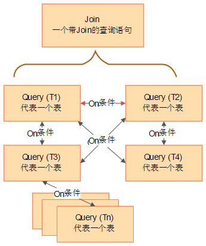

GeeQuery使用手册——Chapter-6  Criteria API多表操作

[TOC]

# Chapter-6  Criteria API多表操作

级联操作本质上是一种单表操作。所有的级联操作都可以以多次单表查询的方式来完成。

但前面的大多数级联操作都使用了自动外连接的功能，因此在查询时，实际上看到的是一个多表连接后的Join查询语句。这种SQL语句在EF-ORM内实现也是使用Criteria API来做到的。

前面的单表Criteria API中大家可以理解，一个单表操作SQL语句可以被抽象后用一个Query对象表示。多表操作Criteria API的概念也差不多。一个多表查询的SQL语句被java抽象后，可以用一个Join对象或者一个UnionQuery对象表示。

Join对象其实就是一个典型的Join的SQL语句在Java中的映射，一般来说标准的Join语句是

~~~sql
select  t1.*, t2.* … from TABLE1 t1,
  left join TABLE2 t2 on t1.xx=t2.xx
  left join TABLE3 t3 on t1.xx=t3.xx and t2.xx=t3.xx
 where t1.xxx=条件 and t2.xxx=条件 and t3.xxx=条件
~~~

可以发现，一个Join语句是针对多个表（或者视图或查询结果）。每个表都可以有自己的where条件（或者没有条件）。表和表之间用 ON条件进行连接。

很多时候，我们在不太复杂的Join语句中，将On条件也放在where条件后面来写，这样写更方便，不过某些时候的计算顺序会和标准写法出现误差，造成一些计算结果不正确的问题。

在Java中，我们也将SQL语句映射为一个Join对象，其包含了多个Query对象，Query之间用 on 条件进行连接。on条件数量不定。

 

图6-1 Join的构成 

上图可以看出，一个Join由多个单表的Query对象构成。我们在实际使用时，可以自由的组合各种Query，形成一个Join查询对象。这个模型实际上和我们编写的SQL是一样的。

## 6.1.  Join查询

### 6.1.1.  基本用法

多表查询的主要场景都是Join查询。Join查询由多个单表的子查询构成，这点在前面已经叙述了。来看看实际用法。

orm-tutorial\src\main\java\org\easyframe\tutorial\lesson6\Case1.java

~~~java
@Test
public void testMultiTable() throws SQLException {
	Query<Person> p = QB.create(Person.class);
	Query<Item> i = QB.create(Item.class);
	Join join = QB.innerJoin(p, i, QB.on(Person.Field.name, Item.Field.name));
	// 不指定返回数据的类型时，Join查询默认返回Map对象。
	Map<String, Object> o = db.load(join);
	System.out.println(o);

	// 如果指定返回“多个对象”，那么返回的Object[]中就包含了 Person对象和Item对象
	{
		Object[] objs = db.loadAs(join, Object[].class);
		Person person = (Person) objs[0];
		Item item = (Item) objs[1];

		assertEquals(person.getName(), item.getName());
		System.out.println(person);
		System.out.println(item);
	}
	// 上面的join对象中只有两张表，还可以追加新的表进去
	{
		join.innerJoin(QB.create(Student.class), 
				QB.on(Person.Field.name, Student.Field.name));
		Object[] objs = db.loadAs(join, Object[].class);
		Person person = (Person) objs[0];
		Item item = (Item) objs[1];
		Student student = (Student) objs[2];
		assertEquals(person.getName(), item.getName());
		assertEquals(item.getName(), student.getName());
		System.out.println(student);
	}
}
~~~

从上例中，我们可以发现

1. 可以用QueryBuilder.innerJoin()将两个Query对象拼接在一起形成内连接。形成Join对象后，join对象自带innerJoin方法，用于添加新的查询表。

2. 使用QueryBuilder.on()可以指定Join时的连接键。

3. 如果不指定Join查询的返回类型，那么会返回所有字段形成的Map，如果指定Join查询返回Object[]类型。  那么会将所有参与查询的表的映射对象以数组的形式返回。

    Join场景下，查询结果返回的最常用形式是这两种。但其实EF-ORM也支持其他很多种结果转换形式。相关内 容请  参见8.1节 查询结果的返回。

在QueryBuilder中，有以下几个方法用于创建Join连接

| 方法                          | 效果                                       |
| :-------------------------- | ---------------------------------------- |
| **innerJoin(q1,q2)**        | 创建内连接                                    |
| **leftJoin(q1,q2)**         | 创建左外连接                                   |
| **rightJoin(q1,q2)**        | 创建右外连接                                   |
| **outerJoin(q1,q2)**        | 创建全外连接                                   |
| **innerJoinWithRef(q1,q2)** | 先根据左侧Query对象的级联关系创建级联Join，然后再将其和右侧的对象内连接。 |
| **leftJoinWithRef(q1,q2)**  | 先根据左侧Query对象的级联关系创建级联Join，然后再将其和右侧的对象左外连接。 |
| **rightJoinWithRef(q1,q2)** | 先根据左侧Query对象的级联关系创建级联Join，然后再将其和右侧的对象右外连接。 |
| **outerJoinWithRef(q1,q2)** | 先根据左侧Query对象的级联关系创建级联Join，然后再将其和右侧的对象全外连接。 |

在Join对象中，也有类似的方法。在连接查询中增加新的表。

在上述方法中，入参包括可选择的On条件，该条件指出了新参与查询的表通过哪些键和旧的表连接。使用 QueryBuilder.on()方法，可以为两个Query指定连接条件。

### 6.1.2.  使用Selects对象

其实就EF-ORM的API设计来说，并没有明显的区分单表操作和多表操作，前面单表查询的各种用法，也都可以直接在多表查询中使用。本例中的Selects使用来控制查出的列就是一例。

此外，单表查询中的 SQLExpression、JpqlExpression等特性都可以在多表查询中使用。

orm-tutorial\src\main\java\org\easyframe\tutorial\lesson6\Case1.java

~~~java
@Test
public void testSelectFromJoin() throws SQLException{
	Query<Person> p = QB.create(Person.class);
	Query<Item> i = QB.create(Item.class);
	Join join = QB.innerJoin(p, i, QB.on(Person.Field.name, Item.Field.name));
		
	Selects select=QB.selectFrom(join);
	select.column(Person.Field.id).as("personid");
	select.column(Item.Field.name).as("itemname");
		
	
	List<Map<String,Object>> vars=db.select(join,null);
	for(Map<String,Object> var:vars){
		System.out.println(var);
		//打印出 {itemname=张飞, personid=1}
	}
}
~~~

在上例中，我们可以发现，Query对象和Join对象都是JoinElement的子类，因此selectFrom方法对这两类对象都有效。

同样的，我们在之前单表查询中学习过的这些特性也都能够直接在Join查询中使用——

* Distinct    
* Group by
* Having
* Max() min() avg() count() 等
* 函数的使用

这些都和在单表查询中没有什么区别。

### 6.1.3.  分页和总数

同样的，分页和总数的实现方法和单表查询的API也是一样的，下面是和分页与总数相关的几个API的用法。虽然在单表查询中已经介绍过了。

**计算总数**

| 方法                                       | 作用                                       |
| ---------------------------------------- | ---------------------------------------- |
| **jef.database.Session.count(ConditionQuery)** | 将传入的查询请求（单表/多表）改写为count语句，然后求满足查询条件的记录总数。 |

 

**传入PageLimit限制结果范围**

PageLimit对象包含offset和limit两个参数，其含义与在SQL中一致。

| **方法**                                   | **用途说明**                                 |
| ---------------------------------------- | ---------------------------------------- |
| **Session.select(ConditionQuery,  PageLimit)** | 传入Query形态的查询(单表、Union、Join均可)，限定返回条数在PageLimit区间范围内。 |
| **Session.select(ConditionQuery\<T>,  Class, PageLimit)** | 传入Query形态的查询(单表、Union、Join均可)，结果转换为指定类型，限定返回条数在PageLimit区间范围内。 |
| **Session.iteratedSelect(TypedQuery\<T>,  PageLimit)** | 传入Query形态的查询(单表/级联/Union)，限定返回条数在PageLimit区间范围内。将游标封装为返回结果遍历器。 |
| **Session.iteratedSelect(ConditionQuery,  PageLimit)** | 传入Query形态的查询(单表、Union、Join均可)，限定返回条数在PageLimit区间范围内。将游标封装为返回结果遍历器。 |
| **Session.iteratedSelect(ConditionQuery\<T>,  Class, PageLimit)** | 传入Query形态的查询(单表、Union、Join均可)，限定返回条数在PageLimit区间范围内。将游标封装为返回结果遍历器。 |

**使用pageSelect接口**，得到PageIterator对象。（参见4.1.3.2）

| **方法**                                   | **作用**                                   |
| ---------------------------------------- | ---------------------------------------- |
| **Session.pageSelect(ConditionQuery,  int)** | 传入Query形态的查询(单表、Union、Join均可)            |
| **Session.pageSelect(ConditionQuery,  Class\<T>, int)** | 传入Query形态的查询(单表、Union、Join均可)， 并指定返回结果类型 |

用例子来描述： 下面的例子里使用了两种方法来实现

orm-tutorial\src\main\java\org\easyframe\tutorial\lesson6\Case1.java

~~~java
public void testJoinWithPage()throws SQLException{
	Query<Person> p = QB.create(Person.class);
	Join join=QB.innerJoin(p, QB.create(Student.class), QB.on(Person.Field.gender, Student.Field.gender));
	join.orderByDesc(Person.Field.id);
	//方法1
	{
		int count=db.count(join);
		List<Object[]> result=db.selectAs(join,Object[].class,new PageLimit(3,5));//读取第4~第8条记录
		System.out.println("总数:"+count);
		for(Object[] objs:result){
			System.out.println(Arrays.toString(objs));
		}
	}
	//方法2
	{
		//使用分页查询，每页五条,从第四条开始读取
		Page<Object[]> result=db.pageSelect(join, Object[].class,5).setOffset(3).getPageData(); 
		System.out.println(result.getTotalCount());
		for(Object[] objs:result.getList()){
			System.out.println(Arrays.toString(objs));
		}			
	}
}
~~~

### 6.1.4.  条件容器的问题

Join是由多个Query构成，而每个Query和Join对象本身都提供了addOrderBy等设置排序字段的方法。除此之外，每个Query对象都提供了addCondition方法，这产生了一个问题——即Join查询中的条件和排序应当设置到哪个对象容器中。如果我们在某个Query中设置了条件或者排序字段，然后再将其添加到一个Join对象中，还能正常生效吗？

从设计目的讲，目前无论是直接加入到Join对象上，还是任意Query对象上的条件，都会在查询中生效。

一种做法是，在构成Join的每个Query对象上添加条件和排序字段

orm-tutorial\src\main\java\org\easyframe\tutorial\lesson6\Case1.java

~~~java
@Test
public void testConditionAndOrder1()throws SQLException{
	//两个Query对象，各自设置条件和顺序
	Query<Person> p = QB.create(Person.class);
	p.addCondition(Person.Field.gender, "M");
	p.orderByAsc(Person.Field.id);
		
	Query<Student> s=QB.create(Student.class);
	s.addCondition(Student.Field.dateOfBirth,Operator.IS_NOT_NULL,null);
	s.orderByDesc(Student.Field.grade);
		
	Join join=QB.innerJoin(p,s , QB.on(Person.Field.gender, Student.Field.gender));
	List<Map<String,Object>> result=db.select(join, null);
}
~~~

另一种做法，在第一个Query上添加条件，在join中添加排序字段

orm-tutorial\src\main\java\org\easyframe\tutorial\lesson6\Case1.java

~~~java
public void testConditionAndOrder2()throws SQLException{
	//把条件集中在第一个Query上。
	Query<Person> p = QB.create(Person.class);
	p.addCondition(Person.Field.gender, "M");
	p.orderByAsc(Person.Field.id);
	p.addCondition(Student.Field.dateOfBirth,Operator.IS_NOT_NULL,null);
		
	Join join=QB.innerJoin(p, QB.create(Student.class) , 
	                      QB.on(Person.Field.gender,   Student.Field.gender));
	//join上也可以直接设置排序字段。
	p.orderByDesc(Student.Field.grade);
		
	List<Map<String,Object>> result=db.select(join, null);
}
~~~

上面两种代码实现，运行后可以发现最终效果是一样的。

也就是说：一般情况下，排序和Where条件可以放在Join的任意Query对象上。排序可以直接放在Join对象上。

为什么要限制“一般情况下”？我们需要了解一下在查询时实际发生了什么。我们先来看上面的例子所产生的实际SQL语句。

~~~sql
select T1.ID                AS T1__ID,
       T1.GENDER            AS T1__GENDER,
       T1.PERSON_NAME       AS T1__NAME,
       T1.CURRENT_SCHOOL_ID AS T1__CURRENTSCHOOLID,
       T2.GRADE             AS T2__GRADE,
       T2.NAME              AS T2__NAME,
       T2.ID                AS T2__ID,
       T2.DATE_OF_BIRTH     AS T2__DATEOFBIRTH,
       T2.GENDER            AS T2__GENDER
  from T_PERSON T1
 inner join STUDENT T2 ON T1.GENDER = T2.GENDER
 where T1.GENDER = ?
   and T2.DATE_OF_BIRTH is not null
 order by T1.ID ASC, T2.GRADE DESC
~~~

首先，每个查询列（排序列）在查询语句中，都会添加该列所在表的别名（如T1.ID,中的T1为表T_PEERSON的别名）。这是因为不同的表可能有相同名称的列，所以必须用表别名来限定。因此我们可以理解，每个条件中的Field对象最终是必须要绑定到一个Query上去的。如果我们在每个Query上设置条件，那么这个绑定是由开发人员显式完成的。如果将条件和排序设置到其他Query中或者Join对象中，那么绑定的过程是由框架内部完成的。

我们将由用户完成的绑定称为显式绑定，由框架内部自动完成的称为隐式绑定。隐式绑定是根据每个Field所在的Entity类型来判定的，很显然某种情况下隐式绑定是不准确的（也是危险的），那就是在同一张表多次参与Join的时候。

因此，如果在Join中同一张表参与多次，我们更建议显式的指定每个条件和排序对应的Query。否则的话两种方法都可以，可以按个人喜好使用。

## 6.2.  Union查询

多表查询中，除了Join以外，还有一种特殊的请求类型，即Union Query。

和SQL一样，多组查询（无论是Join的还是单表的， 只要选出的列的类型一样，就可以使用Union关系拼合成一个更大的结果集）。

UnionQuery具有特定的使用意义。我们之所以用数据库来union两个结果集，而不是在java代码中拼合两个结果集，最大的原因是——

* Union语句可以过滤重复行

  使用union关键字，让数据库在拼合两个结果集时，去除完全相同的行。这会造成数据库排序等一系列复杂的操作，因此DBA们经常告诫开发人员，在能使用union all的场合就不要使用union。

* Union语句可以设置独立的排序条件

  除了构成Union查询的子查询可以对结果排序外，Union/Union All语句还可以对汇总后的结果集进行排序，确保汇总后的结果集按特定的顺序列出。

因此，综上所述，我们在日常业务处理中，很难不使用union。

一个union查询的例子是这样的——

orm-tutorial\src\main\java\org\easyframe\tutorial\lesson6\Case1.java

~~~java
@Test
public void testUnion() throws SQLException {
	JoinElement p = QB.create(Person.class);
	p=QB.innerJoin(p, QB.create(School.class));
		
	Selects select = QB.selectFrom(p);
	select.clearSelectItems();
	select.sqlExpression("upper(name) as name");
	select.column(Person.Field.gender);
	select.sqlExpression("'1'").as("grade");
	select.column(School.Field.name).as("schoolName");
		
	Query<Student> s=QB.create(Student.class);
	select = QB.selectFrom(s);
	select.column(Student.Field.name);
	select.column(Student.Field.gender);
	select.column(Student.Field.grade);
	select.sqlExpression("'Unknown'").as("schoolName");
		
	List<Map<String,Object>> result=db.select(QB.union(Map.class,p,s), null);
	System.out.println(result);
}
~~~

上例中，在两个对象的查询语句中，补齐了各自缺少的字段以后，两个查询具有相同的返回结果格式。此时就可以用union语句将两个查询结果合并为一个。(Derby的Union实现较为特殊，结果集之间是按列序号而不是列名进行匹配的，因此要注意列的输出顺序)

QueryBuilder可以用于生成union 查询。

​在SQL语句中，有 union 和 union all 两种合并方式。对应到QueryBuilder中的以下几个方法上。

| 方法                                       | 作用                                       |
| ---------------------------------------- | ---------------------------------------- |
| QueryBuilder.union(TypedQuery\<T>...)    | 将多个Query用 union结合起来。                     |
| QueryBuilder.union(Class\<T>,  ConditionQuery...) | 将多个Query用 union结合起来，查询的返回结果为指定的class     |
| QueryBuilder.union(ITableMetadata,  ConditionQuery...) | 将多个Query用 union结合起来，查询的返回结果为指定元模型对应的实体   |
| QueryBuilder.unionAll(TypedQuery\<T>...) | 将多个Query用 union all结合起来。                 |
| QueryBuilder.unionAll(Class\<T>,  ConditionQuery...) | 将多个Query用 union all结合起来，查询的返回结果为指定的class |
| QueryBuilder.unionAll(ITableMetadata,  ConditionQuery...) | 将多个Query用 union all结合起来，查询的返回结果为指定元模型对应的实体 |

在使用union或unionAll方法时，需要传入一个类型，该类型为union查询最终要返回的结果容器。可以使用Map，也可以是任意对象。

关于排序

UnionQuery可以有单独的排序列，这个排序列属于union query独有，和各个Query对象的排序之间没有关系。这也是union语句的固有特点。再看下面的示例——

orm-tutorial\src\main\java\org\easyframe\tutorial\lesson6\Case1.java

~~~java
@Test
public void testUnion2() throws SQLException {
	Query<Person> p = QB.create(Person.class);
	p.orderByDesc(Person.Field.currentSchoolId);
	Selects select = QB.selectFrom(p);
	select.column(Person.Field.name).as("name");
	select.column(Person.Field.gender);
		
	Query<Student> s=QB.create(Student.class);
	s.orderByAsc(Student.Field.grade);
	select = QB.selectFrom(s);
	select.column(Student.Field.name);
	select.column(Student.Field.gender);
	List<Student> result=db.select(QB.union(Student.class,p,s).orderByAsc(Student.Field.name));
	for(Student st:result){
		System.out.println(st.getName()+":"+st.getGender());	
	}
}
~~~

执行上述代码，观察输出的SQL语句可以看到

~~~sql
(select t.PERSON_NAME AS NAME,
	   t.GENDER
 from T_PERSON t
 order by t.CURRENT_SCHOOL_ID DESC)
 union
(select t.NAME,
	   t.GENDER
 from STUDENT t
 order by t.GRADE ASC) order by NAME ASC 
~~~

从SQL语句观察，可以发现各个子查询的排序列（Order By）和整个union语句的排序列其作用和定义是不同的。

## 6.3.  Exists条件和NotExists条件

我们还有可能会需要写带有exists条件的SQL语句。一个例子是——

Q: 查出所有姓名在Student表中出现过的Person。

 A: 

~~~sql
select t.*
from T_PERSON t 　　
where exists (select 1 from STUDENT et where t.PERSON_NAME = et.NAME)
~~~

在这个例子中，exists带来了一个子查询，并且和父表发生了内连接。

EF-ORM中，也能生成这样的查询——

orm-tutorial\src\main\java\org\easyframe\tutorial\lesson6\Case1.java

~~~java
@Test
public void testExists() throws SQLException{
	Query<Person> p=QB.create(Person.class);
		
	//级联功能生效的情况下，查询依然是正确的。此处为了输出更简单的SQL语句暂时关闭级联功能。
	//您可以尝试开启级联功能进行查询
	p.setCascade(false); 
	p.addCondition(QB.exists(QB.create(Student.class), QB.on(Person.Field.name, Student.Field.name)));
	System.out.println(db.select(p));
}
~~~

上面这个查询，将Exists作为一个特殊的条件进行处理。因此严格意义上面的查询语句是一个“单表查询”，因此级联功能依然会生效。为了使得生成的SQL更为简单，我们通过p.setCascade(**false**);语句关闭了级联功能。如果去掉这句语句，您将可以看到级联功能和exists共同生效的场景。

那么现在我们把问题变一下——

Q: 查出所有姓名未出现在Student表中的Person。

问题很简单，把exists改为not exists就可以了。

orm-tutorial\src\main\java\org\easyframe\tutorial\lesson6\Case1.java

~~~java
@Test
public void testNotExists() throws SQLException{
	Query<Person> p=QB.create(Person.class);
		
	p.addCondition(QB.notExists(QB.create(Student.class), QB.on(Person.Field.name, Student.Field.name)));
	System.out.println(db.select(p));
}
~~~

您可能已经发现，多表查询下是不支持级联功能的。而上面的Exists和Not Exists中都出现了级联功能，所以实际上这两个例子都是单表查询。放在这一章仅仅是因为人们的习惯而已。

 多表下的API查询就介绍到这里。关于多表查询下返回结果有哪些格式、用什么容器返回结果，本章没有介绍。因为EF-ORM无论在单表/多表/NativeQuery下，都有统一的查询结果返回规则。所以这部分内容将在学习完NativeQuery以后的第八章再介绍。